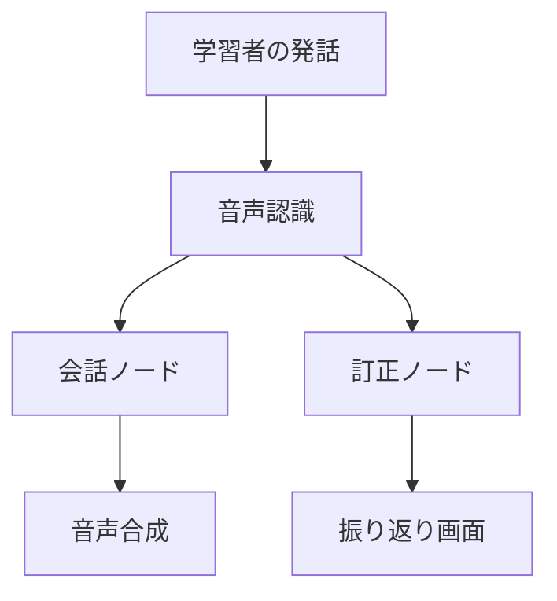

CLAUDE.md（プロジェクトメモリ）

## 概要
開発を進めるうえで遵守すべき標準ルールを定義します。

## プロジェクト構造
本リポジトリは、**日本語の話す練習コーチ**（Japanese Speaking Coach）専用のリポジトリです。
バンガロールで日本語を学び始めた人が AI と音声で会話し、会話終了後に訂正と英語の理由を受け取る Web アプリを開発します。

- **企画の正本は `PLAN.md`**（日本語）。目的・スコープ・完了条件・実行計画はすべてここにあります。
  `docs/` と `.steering/` の内容が PLAN.md と食い違った場合は **PLAN.md が優先**です。
- **`PLAN.md` は git の追跡対象外（`.gitignore` 済み）。** 契約・ビザ・応募先などの個人情報を含むため
  公開しません。**公開ドキュメントから PLAN.md へリンクしないこと**（公開リポジトリでリンク切れになります）。
- 本ファイルは「**どう進めるか**」の手順のみを定義します。「**何を作るか**」は PLAN.md を参照してください。

### 言語ルール

`docs/` は **`docs/ja/`（日本語）と `docs/en/`（英語）の2言語で保守する**。

| 対象 | 言語 | 備考 |
|---|---|---|
| `docs/ja/` | 日本語 | **こちらが正本。必ず先に編集する** |
| `docs/en/` | 英語 | `docs/ja/` の翻訳。**ja を変えたら同じ作業の中で en も直す** |
| `README.md` | **英語** | 公開の入口であり、面接官が最初に読む。日本語にしない |
| `PLAN.md`・本ファイル・`.steering/` | 日本語 | 自分用の作業ドキュメント。スピード優先 |

**2言語版は放っておくと必ず片方が古くなる。** 次の2つを守ること。

- **`docs/en/` だけを直さない。** 英語版に気づいた誤りがあっても、まず `docs/ja/` を直してから翻訳を当てる
- **ドキュメントの更新は ja と en を1つのコミットに含める。** 別コミットに分けると片方が忘れられる

`.steering/` は公開リポジトリに含まれるが、日本語のままでよい（機微な情報を書かないこと）。

### ドキュメントの分類

#### 1. 永続的ドキュメント（`docs/`）

アプリケーション全体の「**何を作るか**」「**どう作るか**」を定義する恒久的なドキュメント。
アプリケーションの基本設計や方針が変わらない限り更新されません。

- **product-requirements.md** - プロダクト要求定義書
　- プロダクトビジョンと目的
　- ターゲットユーザーと課題・ニーズ
　- 主要な機能一覧
　- 成功の定義
　- ビジネス要件
　- ユーザーストーリー
　- 受け入れ条件
　- 機能要件
　- 非機能要件

- **functional-design.md** - 機能設計書
　- 機能ごとのアーキテクチャ
　- システム構成図
　- データモデル定義（ER図含む）
　- コンポーネント設計
　- ユースケース図、画面遷移図、ワイヤフレーム
　- API設計（将来的にバックエンドと連携する場合）

- **architecture.md** - 技術仕様書
　- テクノロジースタック
　- 開発ツールと手法
　- 技術的制約と要件
　- パフォーマンス要件

- **repository-structure.md** - リポジトリ構造定義書
　- フォルダ・ファイル構成
　- ディレクトリの役割
　- ファイル配置ルール

- **development-guidelines.md** - 開発ガイドライン
　- コーディング規約
　- 命名規則
　- スタイリング規約
　- テスト規約
　- Git規約

- **glossary.md** - ユビキタス言語定義
　- ドメイン用語の定義
　- ビジネス用語の定義
　- UI/UX用語の定義
　- 英語・日本語対応表
　- コード上の命名規則

**本プロジェクトでの運用（2026-08-02 決定 / 2026-08-03 改訂）**

6点すべてを最初から厚く書きません。ただし理由は「書く手間」ではありません。
**書くのが Claude でも、読んで検証するのは自分だけ**であり、まだ決めていない設計を厚く書かせれば
**もっともらしい捏造が混ざる**からです。気づかなければ、公開リポジトリに**コードと矛盾した設計書**が残ります。
面接官が読むものとして、**薄くて正しい ＞ 厚くて古い**。さらに ja/en の2言語なので、厚さのコストは常に2倍かかります。

したがって判断軸は厚さではなく、**その内容がすでに「決定済み」か「未観測」か**です。

| ドキュメント | いまの扱い | 厚くする条件 |
|---|---|---|
| `glossary.md` | **厚い（対応済）** | — 評価データ120件のラベル体系を固定する中核。ここがぶれると評価が全部やり直しになる |
| `development-guidelines.md` | **今すぐ厚くしてよい** | 規約は「観測」ではなく「決定」。先に書いても嘘にならない**唯一の例外** |
| `functional-design.md` | **増補済み（2026-08-16）** | 訂正 JSON スキーマが確定した時点で条件を満たし、構成図・データ構造・エラーハンドリングを実物に合わせて増補済み |
| `architecture.md` | **増補済み（2026-08-16）** | ~~Day 5 のベースライン測定後。実測のモデル・レイテンシ・コストが数字で入ってから~~ → **レイテンシとコストは測らないと決めた**ので、この条件は永久に満たされない。実測のモデルと語彙段階の出どころが入った時点で増補済み |
| `product-requirements.md` | **薄いまま固定** | 厚くしない。実体は PLAN.md であり、厚くすると非公開文書との二重管理になる。**PLAN.md へリンクもしない**（公開側でリンク切れになる） |
| `repository-structure.md` | **薄いまま固定** | 厚くしない。ディレクトリが増えれば自然に増える。先回りする意味がない |

**未観測のものを先に厚く書かない。**実装・計測が終わってから、実物に合わせて増補します。
増補するときも **ja を先に直し、en を同じコミットに含める**（言語ルール参照）。

各ドキュメントは `docs/ja/` と `docs/en/` の両方に存在します（言語ルール参照）。

#### 2. 作業単位のドキュメント（`.steering/[YYYYMMDD]-[開発タイトル]/`）

特定の開発作業における「**今回何をするか**」を定義する一時的なステアリングファイル。
作業完了後は参照用として保持されますが、新しい作業では新しいディレクトリを作成します。

- **requirements.md** - 今回の作業の要求内容
　- 変更・追加する機能の説明
　- ユーザーストーリー
　- 受け入れ条件
　- 制約事項

- **design.md** - 変更内容の設計
　- 実装アプローチ
　- 変更するコンポーネント
　- データ構造の変更
　- 影響範囲の分析

- **tasklist.md** - タスクリスト
　- 具体的な実装タスク
　- タスクの進捗状況
　- 完了条件

### ステアリングディレクトリの命名規則

```
.steering/[YYYYMMDD]-[開発タイトル]/
```

**例：**
- `.steering/20250103-initial-implementation/`
- `.steering/20250115-add-tag-feature/`
- `.steering/20250120-fix-filter-bug/`
- `.steering/20250201-improve-performance/`

## 開発プロセス

### 初回セットアップ時の手順

#### 1. フォルダ作成
```bash
mkdir -p docs/ja docs/en
mkdir -p .steering
```

#### 2. 永続的ドキュメント作成（`docs/`）

アプリケーション全体の設計を定義します。
各ドキュメントを作成後、必ず確認・承認を得てから次に進みます。

1. `product-requirements.md` - プロダクト要求定義書
2. `functional-design.md` - 機能設計書
3. `architecture.md` - 技術仕様書
4. `repository-structure.md` - リポジトリ構造定義書
5. `development-guidelines.md` - 開発ガイドライン
6. `glossary.md` - ユビキタス言語定義

**各ファイルは `docs/ja/` と `docs/en/` の両方に作る**（日本語が先、英語は翻訳）。

**承認の粒度（2026-08-02 決定）：厚く書くドキュメントは1ファイルごとに承認を得る。
薄く書くと決めたものはまとめて作成し、最後に一括で確認する。**
1ファイルずつ承認を待つ本来の手順は、薄いドキュメントに対しては往復が多すぎて割に合わない。
**あとから増補するとき（上表の「厚くする条件」を満たしたとき）も、1ファイルごとに承認を得る。**
増補は捏造が混ざりやすい局面なので、まとめ出しにしない。

#### 3. 初回実装用のステアリングファイル作成

初回実装用のディレクトリを作成し、実装に必要なドキュメントを配置します。

```bash
mkdir -p .steering/[YYYYMMDD]-initial-implementation
```

作成するドキュメント：
1. `.steering/[YYYYMMDD]-initial-implementation/requirements.md` - 初回実装の要求
2. `.steering/[YYYYMMDD]-initial-implementation/design.md` - 実装設計
3. `.steering/[YYYYMMDD]-initial-implementation/tasklist.md` - 実装タスク

#### 4. 環境セットアップ

#### 5. 実装開始

`.steering/[YYYYMMDD]-initial-implementation/tasklist.md` に基づいて実装を進めます。

#### 6. 品質チェック

- コード：`ruff` と `mypy`、および `pytest`
- ドキュメント：**`docs/ja/development-guidelines.md` の「ドキュメントの自己点検」6観点**を当てる

### 機能追加・修正時の手順

#### 1. 影響分析

- 永続的ドキュメント（`docs/`）への影響を確認
- 変更が基本設計に影響する場合は **`docs/ja/` を更新し、同じコミットで `docs/en/` も揃える**

#### 2. ステアリングディレクトリ作成

新しい作業用のディレクトリを作成します。

```bash
mkdir -p .steering/[YYYYMMDD]-[開発タイトル]
```

**例：**
```bash
mkdir -p .steering/20250115-add-tag-feature
```

#### 3. 作業ドキュメント作成

作業単位のドキュメントを作成します。
各ドキュメント作成後、必ず確認・承認を得てから次に進みます。

1. `.steering/[YYYYMMDD]-[開発タイトル]/requirements.md` - 要求内容
2. `.steering/[YYYYMMDD]-[開発タイトル]/design.md` - 設計
3. `.steering/[YYYYMMDD]-[開発タイトル]/tasklist.md` - タスクリスト

**重要：** 1ファイルごとに作成後、必ず確認・承認を得てから次のファイル作成を行う

#### 4. 永続的ドキュメント更新（必要な場合のみ）

変更が基本設計に影響する場合、該当する `docs/ja/` を更新し、**同じコミットで `docs/en/` も揃えます**。

#### 5. 実装開始

`.steering/[YYYYMMDD]-[開発タイトル]/tasklist.md` に基づいて実装を進めます。

#### 6. 品質チェック

- コード：`ruff` と `mypy`、および `pytest`
- ドキュメント：**`docs/ja/development-guidelines.md` の「ドキュメントの自己点検」6観点**を当てる
- 指摘が実装の判断を含む場合は、tasklist にタスクを追加してから閉じる

## ドキュメント管理の原則

### 永続的ドキュメント（`docs/`）
- アプリケーションの基本設計を記述
- 頻繁に更新されない
- 大きな設計変更時のみ更新
- プロジェクト全体の「北極星」として機能

### 作業単位のドキュメント（`.steering/`）
- 特定の作業・変更に特化
- 作業ごとに新しいディレクトリを作成
- 作業完了後は履歴として保持
- 変更の意図と経緯を記録

## 図表・ダイアグラムの記載ルール

### 記載場所
設計図やダイアグラムは、関連する永続的ドキュメント内に直接記載します。
独立したdiagramsフォルダは作成せず、手間を最小限に抑えます。

**配置例：**
- ER図、データモデル図 → `functional-design.md` 内に記載
- ユースケース図 → `functional-design.md` または `product-requirements.md` 内に記載
- 画面遷移図、ワイヤフレーム → `functional-design.md` 内に記載
- システム構成図 → `functional-design.md` または `architecture.md` 内に記載

### 記述形式
1. **Mermaid記法（推奨）**
　 - Markdownに直接埋め込める
　 - バージョン管理が容易
　 - ツール不要で編集可能



2. **ASCII アート**
　 - シンプルな図表に使用
　 - テキストエディタで編集可能

```
┌─────────────┐
│　Scene Select　　　│
└─────────────┘
　　　 │
　　　 ↓
┌─────────────┐
│　Conversation　　　│
└─────────────┘
　　　 │
　　　 ↓
┌─────────────┐
│　Review　　　　　　　　│
└─────────────┘
```

3. **画像ファイル（必要な場合のみ）**
　 - 複雑なワイヤフレームやモックアップ
　 - `docs/images/` フォルダに配置
　 - PNG または SVG 形式を推奨

### 図表の更新
- 設計変更時は対応する図表も同時に更新
- 図表とコードの乖離を防ぐ

## 注意事項

- ドキュメントの作成・更新は段階的に行い、各段階で承認を得る
- `.steering/` のディレクトリ名は日付と開発タイトルで明確に識別できるようにする
- 永続的ドキュメントと作業単位のドキュメントを混同しない
- コード変更後は必ずリント・型チェック（`ruff` / `mypy`）を実施する
- **見た目は CSS のみで作る。UI フレームワークやデザインシステムは導入しない**
  （PLAN.md「見た目（和風・1時間で切る）」に従い、生成り × 墨 × 差し色1色。装飾は引き算で作る）
- セキュリティを考慮したコーディング
  - 秘密情報は環境変数から読む。`.env` は絶対にコミットしない（`.env.example` のみ）
  - 学習者の発話・音声は個人情報として扱う。**そもそも保存しない**（2026-08-16 決定。DB もファイルもログも無い）。
    **保存しないので同意記録も持たない**——注意書き（外部 API へ送られること・機密情報を話さないこと・
    AI の合成音声であること）と連絡先だけを必ず出す
  - 大規模モデルへの入力長・録音長・1日あたりのトークン量に上限を設ける
- 図表は必要最小限に留め、メンテナンスコストを抑える
- **スコープを勝手に広げない。** PLAN.md「**11月末までにやらないこと**」に挙がっているもの
  （発音採点・ローカルモデル・React 画面・復習リストの画面・評価データ150件超・
  **DSPy / scikit-learn / AWS**）は提案も実装もしない
- **稼働は週6.5時間（平日0.5h・休日2h）で、実装に使えるのは実質 週4h（土日の2h×2）。**
  **平日の0.5h枠に実装タスクを置かない**（思い出すだけで消える。調べもの・レビュー・ドキュメントに使う）。
  ステアリングの tasklist を作るときは、**この上限を超える見積りを書かない**
