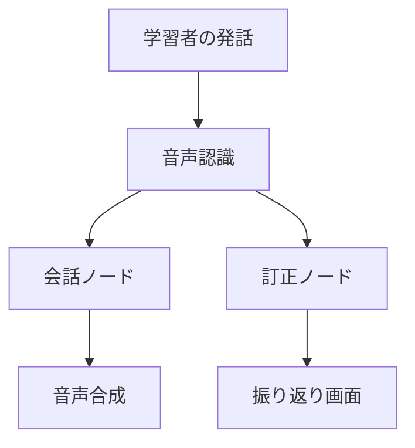

CLAUDE.md（プロジェクトメモリ）

## 概要
開発を進めるうえで遵守すべき標準ルールを定義します。

## プロジェクト構造
本リポジトリは、**日本語の話す練習コーチ**（Japanese Speaking Coach）専用のリポジトリです。
バンガロールで日本語を学び始めた人が AI と音声で会話し、会話終了後に訂正と英語の理由を受け取る Web アプリを開発します。

- **企画の正本は `PLAN.md`**（日本語）。目的・スコープ・完了条件・実行計画はすべてここにあります。
  `docs/` と `.steering/` の内容が PLAN.md と食い違った場合は **PLAN.md が優先**です。
- **`PLAN.md` は git の追跡対象外（`.gitignore` 済み）。** 契約・ビザ・応募先などの個人情報を含むため
  公開しません。**公開ドキュメントから PLAN.md へリンクしないこと**（公開リポジトリでリンク切れになります）。
- 本ファイルは「**どう進めるか**」の手順のみを定義します。「**何を作るか**」は PLAN.md を参照してください。

### 言語ルール

- **`docs/` と README は英語で書く**（公開リポジトリであり、読み手は日本語を読めない想定のため）
- `PLAN.md`・本ファイル・`.steering/` は日本語で書いてよい（自分用の作業ドキュメントでありスピード優先）
- `docs/` の中で日本語が出てよいのは次の3つのみ
  1. 学習対象の日本語文（例文・評価データ・文法リファレンスの中身）
  2. `glossary.md` の用語対応表の日本語列（英語話者に用語の対応を示すために必要）
  3. 採点ラベルなど、日本語のまま運用する固定語（妥当／不十分／誤り）

### ドキュメントの分類

#### 1. 永続的ドキュメント（`docs/`）

アプリケーション全体の「**何を作るか**」「**どう作るか**」を定義する恒久的なドキュメント。
アプリケーションの基本設計や方針が変わらない限り更新されません。

- **product-requirements.md** - プロダクト要求定義書
　- プロダクトビジョンと目的
　- ターゲットユーザーと課題・ニーズ
　- 主要な機能一覧
　- 成功の定義
　- ビジネス要件
　- ユーザーストーリー
　- 受け入れ条件
　- 機能要件
　- 非機能要件

- **functional-design.md** - 機能設計書
　- 機能ごとのアーキテクチャ
　- システム構成図
　- データモデル定義（ER図含む）
　- コンポーネント設計
　- ユースケース図、画面遷移図、ワイヤフレーム
　- API設計（将来的にバックエンドと連携する場合）

- **architecture.md** - 技術仕様書
　- テクノロジースタック
　- 開発ツールと手法
　- 技術的制約と要件
　- パフォーマンス要件

- **repository-structure.md** - リポジトリ構造定義書
　- フォルダ・ファイル構成
　- ディレクトリの役割
　- ファイル配置ルール

- **development-guidelines.md** - 開発ガイドライン
　- コーディング規約
　- 命名規則
　- スタイリング規約
　- テスト規約
　- Git規約

- **glossary.md** - ユビキタス言語定義
　- ドメイン用語の定義
　- ビジネス用語の定義
　- UI/UX用語の定義
　- 英語・日本語対応表
　- コード上の命名規則

**本プロジェクトでの運用（2026-08-02 決定）**

個人開発で稼働が約56時間しかないため、6点すべてを厚く書きません。優先度は以下のとおりです。

| ドキュメント | 扱い | 理由 |
|---|---|---|
| `glossary.md` | **厚く書く** | 評価データ120件のラベル体系（訂正カテゴリ・レベル定義・「余計な直し」の判定基準）を固定する。ここがぶれると評価が全部やり直しになる |
| `architecture.md` | 薄く書く | PLAN.md の技術スタック表を公開用に切り出す |
| `product-requirements.md` | 薄く書く | 実体は PLAN.md。英語の要約のみ置き、詳細はリンクする |
| `functional-design.md` | 薄く書く | 構成図とデータ構造のみ |
| `repository-structure.md` | 薄く書く | ディレクトリ一覧のみ |
| `development-guidelines.md` | 薄く書く | Python の規約とテスト方針のみ |

**薄いドキュメントを厚くするのは、実装が進んで内容が確定してからにします。**先に書くと嘘が増えます。

#### 2. 作業単位のドキュメント（`.steering/[YYYYMMDD]-[開発タイトル]/`）

特定の開発作業における「**今回何をするか**」を定義する一時的なステアリングファイル。
作業完了後は参照用として保持されますが、新しい作業では新しいディレクトリを作成します。

- **requirements.md** - 今回の作業の要求内容
　- 変更・追加する機能の説明
　- ユーザーストーリー
　- 受け入れ条件
　- 制約事項

- **design.md** - 変更内容の設計
　- 実装アプローチ
　- 変更するコンポーネント
　- データ構造の変更
　- 影響範囲の分析

- **tasklist.md** - タスクリスト
　- 具体的な実装タスク
　- タスクの進捗状況
　- 完了条件

### ステアリングディレクトリの命名規則

```
.steering/[YYYYMMDD]-[開発タイトル]/
```

**例：**
- `.steering/20250103-initial-implementation/`
- `.steering/20250115-add-tag-feature/`
- `.steering/20250120-fix-filter-bug/`
- `.steering/20250201-improve-performance/`

## 開発プロセス

### 初回セットアップ時の手順

#### 1. フォルダ作成
```bash
mkdir -p docs
mkdir -p .steering
```

#### 2. 永続的ドキュメント作成（`docs/`）

アプリケーション全体の設計を定義します。
各ドキュメントを作成後、必ず確認・承認を得てから次に進みます。

1. `docs/product-requirements.md` - プロダクト要求定義書
2. `docs/functional-design.md` - 機能設計書
3. `docs/architecture.md` - 技術仕様書
4. `docs/repository-structure.md` - リポジトリ構造定義書
5. `docs/development-guidelines.md` - 開発ガイドライン
6. `docs/glossary.md` - ユビキタス言語定義

**重要：** 1ファイルごとに作成後、必ず確認・承認を得てから次のファイル作成を行う

#### 3. 初回実装用のステアリングファイル作成

初回実装用のディレクトリを作成し、実装に必要なドキュメントを配置します。

```bash
mkdir -p .steering/[YYYYMMDD]-initial-implementation
```

作成するドキュメント：
1. `.steering/[YYYYMMDD]-initial-implementation/requirements.md` - 初回実装の要求
2. `.steering/[YYYYMMDD]-initial-implementation/design.md` - 実装設計
3. `.steering/[YYYYMMDD]-initial-implementation/tasklist.md` - 実装タスク

#### 4. 環境セットアップ

#### 5. 実装開始

`.steering/[YYYYMMDD]-initial-implementation/tasklist.md` に基づいて実装を進めます。

#### 6. 品質チェック

### 機能追加・修正時の手順

#### 1. 影響分析

- 永続的ドキュメント（`docs/`）への影響を確認
- 変更が基本設計に影響する場合は `docs/` を更新

#### 2. ステアリングディレクトリ作成

新しい作業用のディレクトリを作成します。

```bash
mkdir -p .steering/[YYYYMMDD]-[開発タイトル]
```

**例：**
```bash
mkdir -p .steering/20250115-add-tag-feature
```

#### 3. 作業ドキュメント作成

作業単位のドキュメントを作成します。
各ドキュメント作成後、必ず確認・承認を得てから次に進みます。

1. `.steering/[YYYYMMDD]-[開発タイトル]/requirements.md` - 要求内容
2. `.steering/[YYYYMMDD]-[開発タイトル]/design.md` - 設計
3. `.steering/[YYYYMMDD]-[開発タイトル]/tasklist.md` - タスクリスト

**重要：** 1ファイルごとに作成後、必ず確認・承認を得てから次のファイル作成を行う

#### 4. 永続的ドキュメント更新（必要な場合のみ）

変更が基本設計に影響する場合、該当する `docs/` 内のドキュメントを更新します。

#### 5. 実装開始

`.steering/[YYYYMMDD]-[開発タイトル]/tasklist.md` に基づいて実装を進めます。

#### 6. 品質チェック

## ドキュメント管理の原則

### 永続的ドキュメント（`docs/`）
- アプリケーションの基本設計を記述
- 頻繁に更新されない
- 大きな設計変更時のみ更新
- プロジェクト全体の「北極星」として機能

### 作業単位のドキュメント（`.steering/`）
- 特定の作業・変更に特化
- 作業ごとに新しいディレクトリを作成
- 作業完了後は履歴として保持
- 変更の意図と経緯を記録

## 図表・ダイアグラムの記載ルール

### 記載場所
設計図やダイアグラムは、関連する永続的ドキュメント内に直接記載します。
独立したdiagramsフォルダは作成せず、手間を最小限に抑えます。

**配置例：**
- ER図、データモデル図 → `functional-design.md` 内に記載
- ユースケース図 → `functional-design.md` または `product-requirements.md` 内に記載
- 画面遷移図、ワイヤフレーム → `functional-design.md` 内に記載
- システム構成図 → `functional-design.md` または `architecture.md` 内に記載

### 記述形式
1. **Mermaid記法（推奨）**
　 - Markdownに直接埋め込める
　 - バージョン管理が容易
　 - ツール不要で編集可能



2. **ASCII アート**
　 - シンプルな図表に使用
　 - テキストエディタで編集可能

```
┌─────────────┐
│　Scene Select　　　│
└─────────────┘
　　　 │
　　　 ↓
┌─────────────┐
│　Conversation　　　│
└─────────────┘
　　　 │
　　　 ↓
┌─────────────┐
│　Review　　　　　　　　│
└─────────────┘
```

3. **画像ファイル（必要な場合のみ）**
　 - 複雑なワイヤフレームやモックアップ
　 - `docs/images/` フォルダに配置
　 - PNG または SVG 形式を推奨

### 図表の更新
- 設計変更時は対応する図表も同時に更新
- 図表とコードの乖離を防ぐ

## 注意事項

- ドキュメントの作成・更新は段階的に行い、各段階で承認を得る
- `.steering/` のディレクトリ名は日付と開発タイトルで明確に識別できるようにする
- 永続的ドキュメントと作業単位のドキュメントを混同しない
- コード変更後は必ずリント・型チェック（`ruff` / `mypy`）を実施する
- **見た目は CSS のみで作る。UI フレームワークやデザインシステムは導入しない**
  （PLAN.md「見た目（和風・1時間で切る）」に従い、生成り × 墨 × 差し色1色。装飾は引き算で作る）
- セキュリティを考慮したコーディング
  - 秘密情報は環境変数から読む。`.env` は絶対にコミットしない（`.env.example` のみ）
  - 学習者の発話・音声は個人情報として扱う。同意表示と削除依頼の受け口を必ず用意する
  - 大規模モデルへの入力長・録音長・1日あたりのトークン量に上限を設ける
- 図表は必要最小限に留め、メンテナンスコストを抑える
- **スコープを勝手に広げない。** PLAN.md「8月にやらないこと」に挙がっているもの
  （発音採点・ローカルモデル・React 画面・復習リスト画面）は提案も実装もしない
