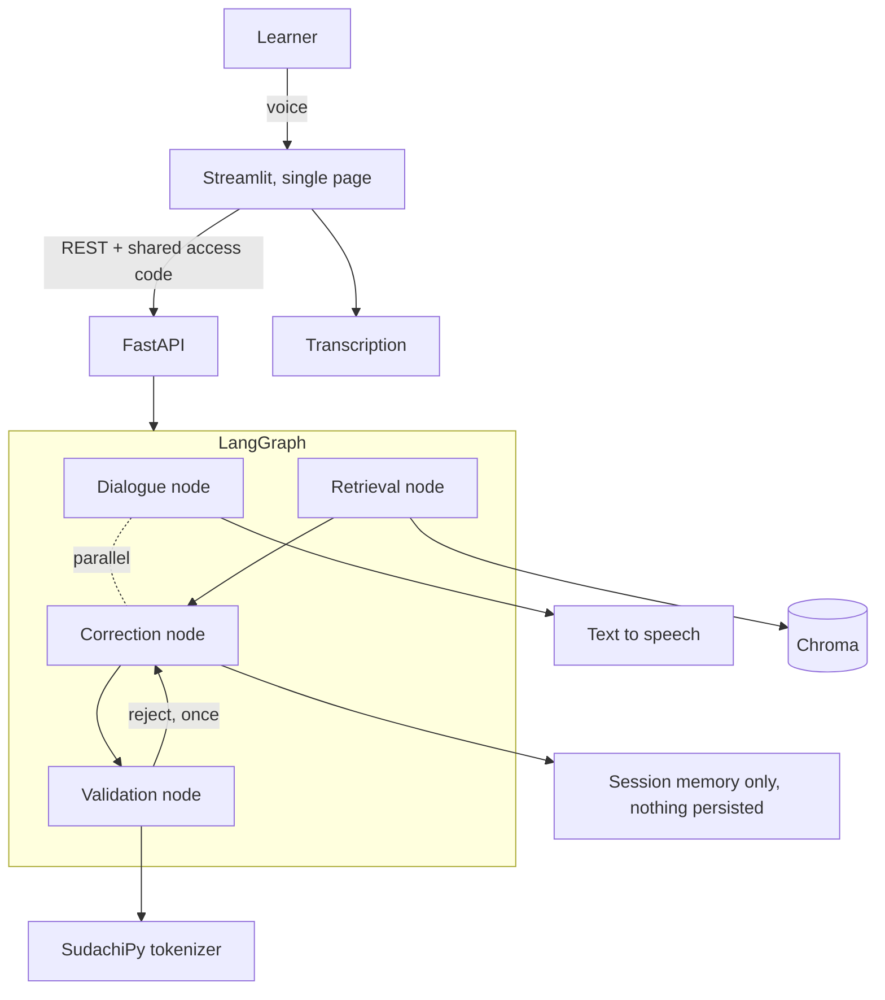

# Japanese Speaking Coach

A speaking-practice partner for people who have just started learning Japanese. You pick a
situation, talk to it **with your voice**, and after the conversation ends you get your
sentences back with a natural phrasing and a short reason in English.

---

## The problem

In Bangalore, a lot of people start learning Japanese. There is a wide gap between reading a
textbook and saying a single sentence out loud to another person. Learners have no one to
speak with, so their mistakes are never corrected, and teachers are vastly outnumbered by
learners. This is a practice partner for the very first steps: speak in your own words from
the easiest situations, and get told afterwards how to say it and why.

## What it does

1. Pick a scene — greeting, self-introduction, thanks, a simple request, saying you will be
   late, workplace politeness
2. **Start conversation** — the AI speaks first
3. Press the microphone and speak. The AI replies by voice. Repeat as many times as you like
4. **End conversation**
5. **Review** — every sentence you said, what should have been corrected, a natural phrasing,
   and a one-to-two sentence reason in English

Input is voice only. No Japanese keyboard is needed, and nobody is ever asked to retype a
sentence the transcription got wrong — there is a **Say again** button instead.

## What it deliberately does not do

No lessons, no drills, no exam preparation, no flashcards, and **no pronunciation scoring**.
Voice is an input method; what gets corrected is *phrasing*, not phonemes. Pronunciation and
pitch-accent assessment are a different problem, and pretending otherwise would make the
quality claims below meaningless.

Corrections also never interrupt the conversation. They are computed every turn in the
background and shown only at the end, because correcting a beginner mid-sentence is the
fastest way to make them stop talking.

## Why build this when good alternatives exist

`japanesecompass.com` is the closest comparison, and it is a strong product (checked
2026-08-02): 2,136 kanji, 3,587 vocabulary entries, 303 grammar points, a 217,524-entry
dictionary, JLPT and JFT-Basic mock exams, branching stories, stroke-order writing practice,
and an AI conversation partner. Most of it is free; the AI conversation is capped at 10
messages a day, and Pro is $49/year.

**Competing on feature count against that is a losing game, so this does not compete there.**

It also does two things this project is often assumed to be first at, so both are stated
plainly rather than glossed over:

- **It corrects.** Its conversation partner offers "gentle corrections", with "teacher-grade
  corrections" on the paid tier. **Correcting Japanese is not a differentiator.**
- **It takes voice.** Its speaking practice records you and even scores your pronunciation.
  **This project does not score pronunciation at all** — see above for why.

The actual gap is narrower, and it is a gap in *combination*. On that site, voice and
conversation are separate features: the speaking practice has you **read a model sentence
aloud and shadow it**, while the AI conversation is a chat you **type** into. You can speak
Japanese, or you can compose your own sentences, but not both at once.

1. **Speak your own words, out loud, in a conversation.** Not shadowing a supplied sentence,
   not typing. This matters beyond convenience: if the learner only repeats fixed phrases,
   **there is nothing left to correct**, and the evaluation this project is built around has
   nothing to measure.
2. **Corrections are withheld until the conversation ends.** Theirs corrects as you go. That
   is a reasonable choice; the opposite one is made here on purpose, because interrupting a
   beginner mid-sentence is the fastest way to make them stop talking.
3. **Correction quality is published as measured numbers.** No comparable service publishes
   accuracy figures — including this one, which sells correction quality as a paid feature
   without quantifying it. **Measuring is the real differentiator**, and it is the part of
   this project worth reading.
4. **Corrections cite a grammar reference** rather than asserting things ungrounded.

---

## Evaluation

This is the part the project is actually about.

**No number appears in this README until it has been measured**, and the method for measuring
each one is written down before the run. A cell with no number in it has not been measured yet;
nothing here is an estimate, and nothing measured is left out because it looks bad. What
is built so far is listed under [Progress](#progress).

**The evaluation set is built and verified by a native Japanese speaker** — every item was
checked by hand. Most candidate sentences are generated by a model and then verified
individually, which is what would make the set expandable rather than a one-off; ten were written by
hand to cover mistake types the generator kept missing, and were verified the same way.
**The set is nonetheless fixed at 120 items**, and what that costs is stated below.

| Property | Value |
|---|---|
| Items | 120 (91 needing correction, 29 already natural) |
| Split | 80 development / 40 held-out test |
| Held-out discipline | Prompts and thresholds are tuned against the dev split only. The test split is touched at the start and the end, never in between |
| Scoring | Only the binary "does this need correcting" label is machine-scored. **Corrected sentences are never scored by exact match** — natural phrasing is not unique |
| Second rater | **Requested, not yet obtained.** One kit of 20 items went out on 8 August and was never answered; it is being collected in person on 13 September. See below |

The 29 already-natural items exist for one reason: to measure **over-correction**. A system
that corrects everything scores well on detection and is useless to a learner. **There are only
13 of them in the test split**, so a single item moves that rate by 7.7 points. The right fix is
more `false` items rather than a wider denominator, and it is a fix this project is not taking:
the set is fixed at 120.

### Baseline comparison

A naive implementation — one model call saying "correct this Japanese and explain why" — is
measured **before** the real implementation exists, so the comparison is honest.

| | Naive (single call) | This implementation |
|---|---|---|
| Detection accuracy (n=27) | **100%** | — |
| **Over-correction rate (n=13)** | **69.2 – 76.9%** | — |
| Correction validity | — | — |

*The baseline was measured on the held-out test split on 11 August, **before any validation code
existed**, which is what makes the comparison honest. The same run was repeated three times under
identical conditions and over-correction came out 9/13, 9/13, 10/13 — **the spread is printed
rather than averaged away**. A perfect detection score next to a 70% over-correction rate is the
naive failure this project exists to fix: it corrects nearly everything, so it never misses, and
it is useless to a learner. Run records: [`evals/runs/`](evals/runs/). Response time and cost are
**not** measured — see [Progress](#progress). Metric definitions:
[`docs/en/glossary.md`](docs/en/glossary.md).*

### Targets

These targets are for **this implementation**, not for the baseline above. The baseline already
scores 100% on detection and fails badly on over-correction; beating it means holding detection
while bringing over-correction down.

| Metric | Target (20 September 2026) | This implementation |
|---|---|---|
| Detection accuracy | ≥ 85% | — |
| Over-correction rate | ≤ 15% | — |
| Correction validity | ≥ 85% | — |
| Second-rater agreement | **not yet obtained** | see below |
| Retrieval hit rate (n=16) | ≥ 80% | — |
| Retrieval abstention rate (n=4) | reported, no target | — |
| Level compliance (n=90) | ≥ 90% after regeneration | **98.9%** after regeneration, **94.4%** first-shot (±5pt on the first-shot figure) |
| Testers | 2–3, with three written comments | — |

**The level-compliance figure to read is the first-shot one.** The post-regeneration number is
produced by gating with the same function that measures it, so it is **not independent
evidence**. It is also measured over 360 content words of which **55 were unknown to the
frequency tiers** and could not be judged either way.

Every published figure carries `n` and an error margin — where `n` is that metric's own
denominator, not the size of the split. The two accuracy figures do not share one: on the
40-item test split `detection_accuracy` rests on the 27 items labelled as needing correction
(±13 points) and `over_correction_rate` on the 13 that do not, where a single item moves the
figure by 7.7 points. Both are stated rather than hidden.

**Correction validity is scored by one person, and that person built the system.** That is the
weakest evidence in this repository and it is stated here rather than left for a reader to work
out. The mitigation is a second native speaker rating 20 items — **drawn from the dev split, not
from the 40 test items**, so that reading them cannot contaminate the held-out set — with the
agreement figure published beside it. The kit went out on 8 August and nothing came back. The
unanswered kit is still in `evals/rater/` with every rating `null`, because "asked and got no
reply" and "never asked" should not look the same from outside. **The rating is being collected
in person on 13 September**; if it is not obtained then, the target reverts to "not measured" and
that will be stated here. Either way the metric stays in the table above — a metric that quietly
disappears reads, correctly, as one dropped because it was inconvenient.

Retrieval is reported as two numbers for the same reason. Each of 30 dev items was annotated in
advance, before any index existed, with the reference article that ought to ground it. **That
annotation was drafted by a model and reviewed by the native speaker who built the set**, so the
hit rate measures agreement between an index and an annotator that is not fully independent of
it — a weaker claim than a human annotation would support, and stated here rather than left in
the working file. Four of the twenty published items turned out to have no such article, because nothing in the reference
covers the polite negative past of a verb, the causative, adverb choice, or 〜んです. Those four
cannot be scored on whether the right article came back. So the hit rate is measured over the
**16 items that have a ground** and reads rank alone, which keeps it independent of the retrieval
score floor; the other **four are reported separately**, on whether anything came back above that
floor, with their dependence on it stated. They are never added together. Rolling them into one
figure would let the score floor be tuned until the number improved, and nothing in this
repository would show that it had been.

### The correction engine is measured on text, and the speech stage is not measured at all

The system has two stages: speech→text and text→correction. Measuring only end-to-end cannot
tell you which one failed — **transcription silently repairs learner mistakes**, so a correct
correction engine can look broken. Correction figures are therefore produced by feeding the
evaluation items directly to the engine, bypassing the app and the microphone entirely.

**The speech stage is not measured.** Measuring it would mean keeping learner recordings and
transcribing them by ear, and this project keeps no audio at all (see [Privacy](#privacy)).
Every correction figure here is therefore text-in, text-out, and **the accuracy a learner
experiences through a microphone is lower than the numbers above.** How much lower is unknown.
Saying so is more useful than an estimate nobody could check.

### Known ways evaluations break, and what is done about them

| Failure mode | Where it would bite here | Mitigation |
|---|---|---|
| Exact-match scoring is brittle | Natural phrasing is not unique | Only the binary label is machine-scored |
| Output in the wrong language | Reasons are required in English | Format compliance is measured **separately** from accuracy |
| Prompt formatting shifts scores | Every prompt edit moves the numbers | Every run records model, prompt version, date and split |
| Silent bugs in the scoring script | Numbers that look too good or too bad | The scoring script has tests, and five items are hand-checked on every `dev` run — never on `test`, where per-item output is suppressed so the held-out answers stay unseen |

---

## Architecture

**Why this is not a thin wrapper around a language model.** The correction is emitted as
structured output and then checked by deterministic Python:

- **Rewrite-too-far** — if the edit distance between the original and the correction exceeds
  a threshold, it is a different sentence, not a correction, and is discarded
- **Vocabulary level** — the AI's reply is tokenised and regenerated if too many words sit
  above the learner's level
- **Over-correction suppression** — if nothing was retrieved to ground the reason and the
  original sentence is already natural, it falls back to "no correction needed"

The baseline table above exists to show what those checks are worth.

One concrete example of why the thresholds are not arbitrary: corrections into polite form
append long fixed endings to short sentences, so `ありがとう → ありがとうございます` reaches a
normalised edit distance of **0.50**. A rewrite-too-far threshold of 0.5 — the obvious first
choice — would silently discard the single most common valid correction this app produces,
and a discarded correction never reaches the learner *and never appears in the metrics*.
The thresholds and the reasoning behind them are in
[`config/thresholds.toml`](config/thresholds.toml).

### Why Japanese makes tokenization necessary

Japanese does not put spaces between words, so string matching cannot find word boundaries.
Checking whether the AI's reply sits above the learner's level therefore requires
morphological analysis (SudachiPy) — it is load-bearing here, not decoration.

## Stack

LangChain (Gemini today, provider swappable in one line) · SudachiPy + SudachiDict ·
sentence-transformers (multilingual) · Chroma · LangGraph · FastAPI · Streamlit · Docker Compose

**No database.** Nothing a learner says is stored, so there is nothing to store it in — see
[Privacy](#privacy).

The speech provider is picked when voice is built, late in the schedule rather than upfront — a
transcriber that quietly repairs the learner's mistakes would erase the thing this app exists to
correct. That risk decides the choice by argument, **not** by measurement, because no audio is
kept to measure against.

Full table with the reasoning for each choice: [`docs/en/architecture.md`](docs/en/architecture.md).

## Running it

Not yet runnable. `docker compose up` will bring up the UI and the API — there is no database —
and the instructions land here once that exists.

## Data, sources and licences

- **Evaluation set** — written for this project, published in this repository
- **Grammar reference** — written for this project
- **SudachiPy / SudachiDict** — Apache-2.0, no share-alike condition. Used for tokenization.
  **Not** the source of the difficulty tiers: it carries no word-frequency information
- **BCCWJ word frequency lists** — Balanced Corpus of Contemporary Written Japanese, National
  Institute for Japanese Language and Linguistics. Short-unit list
  ([DOI 10.15084/00003218](https://doi.org/10.15084/00003218)) and long-unit list
  ([DOI 10.15084/00003212](https://doi.org/10.15084/00003212)), both ver1_0, retrieved
  2026-08-11. NINJAL states they are free to use for research and educational purposes and says
  nothing about redistribution, so **they are fetched and never committed here** — the same
  handling as JMdict below. Rebuild the tier tables with
  `python -m nlp.frequency --build`; the source and the tier boundaries are documented in
  [`nlp/frequency.py`](nlp/frequency.py)
- `wordfreq` was considered and **not** used: its data is CC BY-SA, and it requires MeCab, which
  would mean a second tokenizer alongside SudachiPy
- JMdict and KANJIDIC2 are **not** used (CC BY-SA)
- Commercial textbooks and JLPT past papers are **not** ingested. Difficulty tiers are cut from
  the frequency list above at fixed points of cumulative corpus coverage, so levels are described
  as *approximately* corresponding to JLPT levels and no more than that

## Privacy

**Nothing is stored.** Learner speech, audio and corrections live in the session and are written
to no database, no file and no log. This is a decision rather than an omission: with two or three
testers a usage log supports no statistical claim at all, learner speech is personal data, and
taking on the duty of holding it in exchange for nothing is a bad trade. **The storage options were
weighed, and the answer was to store nothing.** Because nothing is kept, no consent record
is kept either — the notice stays, since recordings really are sent to external APIs.

It costs something. Retention, response time, the number of *Say again* presses, and any
measurement of the speech stage all become impossible. Those were dropped as metrics rather than
quietly worked around.

Testers enter through **one shared access code**; no accounts, no names. Before the first turn the
app will state that recordings go to external APIs, that confidential information should not be
spoken, **that the AI voice is synthetic**, and will give a contact address. A per-session turn
limit and a daily cap are planned as a cost guard, not as a measurement. **None of this is built
yet** — see [Running it](#running-it); it is written here because it constrains the design, not
because it exists.

## Documentation

| | |
|---|---|
| [`docs/en/`](docs/en/) | Product requirements, functional design, architecture, repository structure, development guidelines, glossary |
| [`docs/ja/`](docs/ja/) | The same documents in Japanese. **Japanese is the authoritative version**; English is the translation |
| [`docs/en/glossary.md`](docs/en/glossary.md) | The labelling standard for the evaluation set and the definition of every number in this README |
| [`.steering/`](.steering/) | Per-week working documents: requirements, design, task list (Japanese) |

## Progress

- [x] Evaluation methodology, metric definitions and labelling standard fixed
- [x] Validation thresholds set, with the reasoning recorded
- [x] Text-only conversation and correction loop
- [x] 120-item evaluation set, every item verified by a native speaker
- [x] Baseline measured on the 40-item test split
- [x] Tokenization and the vocabulary-level check, with compliance measured
- [x] Validation nodes: rewrite-too-far, and regeneration on over-level replies
- [ ] Retrieval (Chroma, embeddings) and the retrieval hit rate
- [ ] Baseline vs implementation comparison table
- [ ] FastAPI + LangGraph
- [ ] Docker Compose and a deployed demo
- [ ] Voice input and output
- [ ] Two or three testers, three written comments

**What is deliberately not on this list:** response time, cost per turn, any measurement of the
speech stage, and tester retention. Each was dropped from scope, and each is named here rather
than left off quietly. A second rater's agreement is not dropped but is **not yet obtained**: the
first request went unanswered, and the rating is now being collected in person on 13 September.
The working budget is two hours a day and the deadline is 20 September; what that budget bought,
and what it did not, is the honest version of this table.
