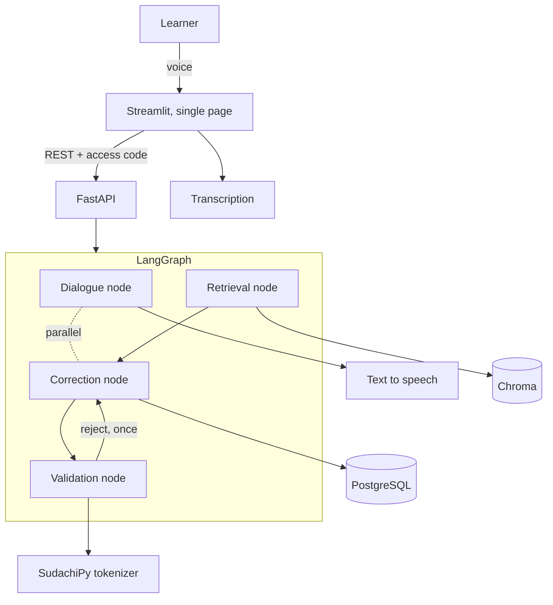

# Japanese Speaking Coach

A speaking-practice partner for people who have just started learning Japanese. You pick a
situation, talk to it **with your voice**, and after the conversation ends you get your
sentences back with a natural phrasing and a short reason in English.

> **Status — 2026-08-02, week 1 of build.** Design and evaluation methodology are fixed;
> implementation has just started. **Every results table below is deliberately empty.**
> No number appears in this README until it has been measured, and the method for measuring
> each one is already written down (see [Evaluation](#evaluation)). Nothing here is an estimate.

---

## The problem

In Bangalore, a lot of people start learning Japanese. There is a wide gap between reading a
textbook and saying a single sentence out loud to another person. Learners have no one to
speak with, so their mistakes are never corrected, and teachers are vastly outnumbered by
learners. This is a practice partner for the very first steps: speak in your own words from
the easiest situations, and get told afterwards how to say it and why.

## What it does

1. Pick a scene — greeting, self-introduction, thanks, a simple request, saying you will be
   late, workplace politeness
2. **Start conversation** — the AI speaks first
3. Press the microphone and speak. The AI replies by voice. Repeat as many times as you like
4. **End conversation**
5. **Review** — every sentence you said, what should have been corrected, a natural phrasing,
   and a one-to-two sentence reason in English

Input is voice only. No Japanese keyboard is needed, and nobody is ever asked to retype a
sentence the transcription got wrong — there is a **Say again** button instead.

## What it deliberately does not do

No lessons, no drills, no exam preparation, no flashcards, and **no pronunciation scoring**.
Voice is an input method; what gets corrected is *phrasing*, not phonemes. Pronunciation and
pitch-accent assessment are a different problem, and pretending otherwise would make the
quality claims below meaningless.

Corrections also never interrupt the conversation. They are computed every turn in the
background and shown only at the end, because correcting a beginner mid-sentence is the
fastest way to make them stop talking.

## Why build this when good alternatives exist

`japanesecompass.com` is the closest comparison, and it is a strong product (checked
2026-08-02): 2,136 kanji, 3,587 vocabulary entries, 303 grammar points, a 217,524-entry
dictionary, JLPT and JFT-Basic mock exams, branching stories, stroke-order writing practice,
and an AI conversation partner. Most of it is free; the AI conversation is capped at 10
messages a day, and Pro is $49/year.

**Competing on feature count against that is a losing game, so this does not compete there.**

It also does two things this project is often assumed to be first at, so both are stated
plainly rather than glossed over:

- **It corrects.** Its conversation partner offers "gentle corrections", with "teacher-grade
  corrections" on the paid tier. **Correcting Japanese is not a differentiator.**
- **It takes voice.** Its speaking practice records you and even scores your pronunciation.
  **This project does not score pronunciation at all** — see above for why.

The actual gap is narrower, and it is a gap in *combination*. On that site, voice and
conversation are separate features: the speaking practice has you **read a model sentence
aloud and shadow it**, while the AI conversation is a chat you **type** into. You can speak
Japanese, or you can compose your own sentences, but not both at once.

1. **Speak your own words, out loud, in a conversation.** Not shadowing a supplied sentence,
   not typing. This matters beyond convenience: if the learner only repeats fixed phrases,
   **there is nothing left to correct**, and the evaluation this project is built around has
   nothing to measure.
2. **Corrections are withheld until the conversation ends.** Theirs corrects as you go. That
   is a reasonable choice; the opposite one is made here on purpose, because interrupting a
   beginner mid-sentence is the fastest way to make them stop talking.
3. **Correction quality is published as measured numbers.** No comparable service publishes
   accuracy figures — including this one, which sells correction quality as a paid feature
   without quantifying it. **Measuring is the real differentiator**, and it is the part of
   this project worth reading.
4. **Corrections cite a grammar reference** rather than asserting things ungrounded.

---

## Evaluation

This is the part the project is actually about.

**The evaluation set is built and verified by a native Japanese speaker** — every item was
checked by hand. Candidate sentences are generated by a model and then verified individually,
which is what makes the set expandable rather than a one-off.

| Property | Value |
|---|---|
| Items | 120 (90 needing correction, 30 already natural) |
| Split | 80 development / 40 held-out test |
| Held-out discipline | Prompts and thresholds are tuned against the dev split only. The test split is touched at the start and the end, never in between |
| Scoring | Only the binary "does this need correcting" label is machine-scored. **Corrected sentences are never scored by exact match** — natural phrasing is not unique |
| Second rater | 20 items are rated independently by a second native speaker, and the agreement rate is published |

The 30 already-natural items exist for one reason: to measure **over-correction**. A system
that corrects everything scores well on detection and is useless to a learner.

### Baseline comparison

A naive implementation — one model call saying "correct this Japanese and explain why" — is
measured **before** the real implementation exists, so the comparison is honest.

| | Naive (single call) | This implementation |
|---|---|---|
| Detection accuracy | — | — |
| **Over-correction rate** | — | — |
| Correction validity | — | — |
| Latency (p95) | — | — |
| Cost per turn | — | — |

*Not yet measured. Metric definitions: [`docs/en/glossary.md`](docs/en/glossary.md).*

### Targets

| Metric | Target | Measured |
|---|---|---|
| Detection accuracy | ≥ 85% | — |
| Over-correction rate | ≤ 15% | — |
| Correction validity | ≥ 85% | — |
| Second-rater agreement | ≥ 80% | — |
| Retrieval hit rate | ≥ 80% | — |
| Level compliance | ≥ 90% | — |
| Testers | ≥ 5 | — |

Every published figure will carry `n` and an error margin. On a 40-item test split that
margin is roughly ±8 points, and it will be stated rather than hidden.

### The correction engine is measured on text, not through the app

The system has two stages: speech→text and text→correction. Measuring only end-to-end cannot
tell you which one failed — **transcription silently repairs learner mistakes**, so a correct
correction engine can look broken. Correction figures are therefore produced by feeding the
evaluation items directly to the engine, bypassing the app and the microphone entirely.
Transcription accuracy is measured separately, later, against recordings transcribed by ear.

### Known ways evaluations break, and what is done about them

| Failure mode | Where it would bite here | Mitigation |
|---|---|---|
| Exact-match scoring is brittle | Natural phrasing is not unique | Only the binary label is machine-scored |
| Output in the wrong language | Reasons are required in English | Format compliance is measured **separately** from accuracy |
| Prompt formatting shifts scores | Every prompt edit moves the numbers | Every run records model, prompt version, date and split |
| Silent bugs in the scoring script | Numbers that look too good or too bad | The scoring script has tests, and 5 items are hand-checked every run |

---

## Architecture

**Why this is not a thin wrapper around a language model.** The correction is emitted as
structured output and then checked by deterministic Python:

- **Rewrite-too-far** — if the edit distance between the original and the correction exceeds
  a threshold, it is a different sentence, not a correction, and is discarded
- **Vocabulary level** — the AI's reply is tokenised and regenerated if too many words sit
  above the learner's level
- **Over-correction suppression** — if nothing was retrieved to ground the reason and the
  original sentence is already natural, it falls back to "no correction needed"

The baseline table above exists to show what those checks are worth.

One concrete example of why the thresholds are not arbitrary: corrections into polite form
append long fixed endings to short sentences, so `ありがとう → ありがとうございます` reaches a
normalised edit distance of **0.50**. A rewrite-too-far threshold of 0.5 — the obvious first
choice — would silently discard the single most common valid correction this app produces,
and a discarded correction never reaches the learner *and never appears in the metrics*.
The thresholds and the reasoning behind them are in
[`config/thresholds.toml`](config/thresholds.toml).

### Why Japanese makes tokenization necessary

Japanese does not put spaces between words, so string matching cannot find word boundaries.
Checking whether the AI's reply sits above the learner's level therefore requires
morphological analysis (SudachiPy) — it is load-bearing here, not decoration.

## Stack

LangChain (Gemini today, provider swappable in one line) · SudachiPy + SudachiDict ·
sentence-transformers (multilingual) · Chroma · LangGraph · FastAPI · Streamlit ·
PostgreSQL · Docker Compose

The speech provider is chosen in week 3 from measurement, not upfront — a transcriber that
quietly repairs the learner's mistakes would erase the thing this app exists to correct.

Full table with the reasoning for each choice: [`docs/en/architecture.md`](docs/en/architecture.md).

## Running it

Not yet runnable. `docker compose up` will bring up the UI, the API and the database; the
instructions land here once that exists.

## Data, sources and licences

- **Evaluation set** — written for this project, published in this repository
- **Grammar reference** — written for this project
- **SudachiPy / SudachiDict** — Apache-2.0, no share-alike condition
- JMdict and KANJIDIC2 are **not** used (CC BY-SA)
- Commercial textbooks and JLPT past papers are **not** ingested. Difficulty tiers are derived
  from word frequency, so levels are described as *approximately* corresponding to JLPT levels

## Privacy

Testers get individual access codes; no accounts, no names stored. Before anything is saved,
the app states that recordings are sent to external APIs, that they are kept in order to
improve the system, that confidential information should not be spoken, **that the AI voice
is synthetic**, and how to request deletion. Audio is retained only for the transcription
study.

## Documentation

| | |
|---|---|
| [`docs/en/`](docs/en/) | Product requirements, functional design, architecture, repository structure, development guidelines, glossary |
| [`docs/ja/`](docs/ja/) | The same documents in Japanese. **Japanese is the authoritative version**; English is the translation |
| [`docs/en/glossary.md`](docs/en/glossary.md) | The labelling standard for the evaluation set and the definition of every number in this README |
| [`.steering/`](.steering/) | Per-week working documents: requirements, design, task list (Japanese) |

## Progress

- [x] Evaluation methodology, metric definitions and labelling standard fixed
- [x] Validation thresholds set, with the reasoning recorded
- [ ] Text-only conversation and correction loop
- [ ] 120-item evaluation set
- [ ] Baseline measured
- [ ] Validation node, tokenization, retrieval
- [ ] Baseline vs implementation comparison table
- [ ] Voice input and output
- [ ] FastAPI + LangGraph
- [ ] Deployed demo, real testers
- [ ] Docker Compose, latency before and after
