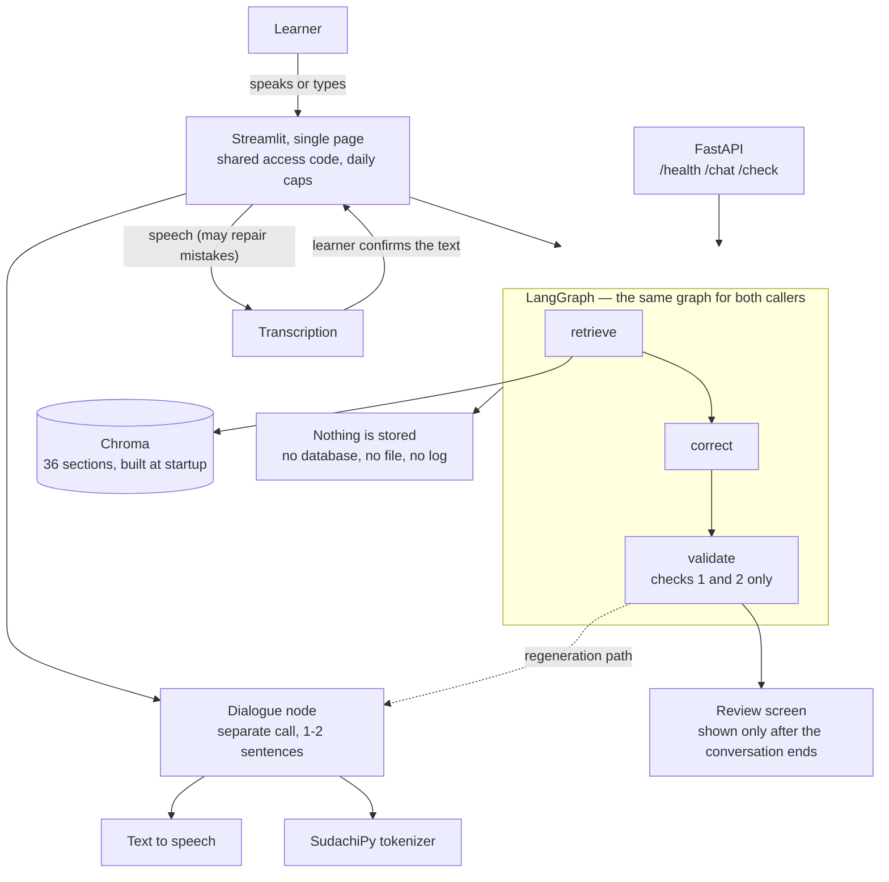

# Japanese Speaking Coach

A speaking-practice partner for people who have just started learning Japanese. You pick a
situation, talk to it **with your voice**, and after the conversation ends you get your
sentences back with a natural phrasing and a short reason in English.

---

## The problem

In Bangalore, a lot of people start learning Japanese. There is a wide gap between reading a
textbook and saying a single sentence out loud to another person. Learners have no one to
speak with, so their mistakes are never corrected, and teachers are vastly outnumbered by
learners. This is a practice partner for the very first steps: speak in your own words from
the easiest situations, and get told afterwards how to say it and why.

## What it does

1. Pick a scene — greeting, self-introduction, thanks, a simple request, saying you will be
   late, workplace politeness
2. **Start conversation** — the AI speaks first
3. Press the microphone and speak. The AI replies by voice. Repeat as many times as you like
4. **End conversation**
5. **Review** — every sentence you said, what should have been corrected, a natural phrasing,
   and a one-to-two sentence reason in English

Input is voice only. No Japanese keyboard is needed, and nobody is ever asked to retype a
sentence the transcription got wrong — there is a **Say again** button instead.

## What it deliberately does not do

No lessons, no drills, no exam preparation, no flashcards, and **no pronunciation scoring**.
Voice is an input method; what gets corrected is *phrasing*, not phonemes. Pronunciation and
pitch-accent assessment are a different problem, and pretending otherwise would make the
quality claims below meaningless.

Corrections also never interrupt the conversation. They are computed every turn in the
background and shown only at the end, because correcting a beginner mid-sentence is the
fastest way to make them stop talking.

## Why build this when good alternatives exist

`japanesecompass.com` is the closest comparison, and it is a strong product (checked
2026-08-02): 2,136 kanji, 3,587 vocabulary entries, 303 grammar points, a 217,524-entry
dictionary, JLPT and JFT-Basic mock exams, branching stories, stroke-order writing practice,
and an AI conversation partner. Most of it is free; the AI conversation is capped at 10
messages a day, and Pro is $49/year.

**Competing on feature count against that is a losing game, so this does not compete there.**

It also does two things this project is often assumed to be first at, so both are stated
plainly rather than glossed over:

- **It corrects.** Its conversation partner offers "gentle corrections", with "teacher-grade
  corrections" on the paid tier. **Correcting Japanese is not a differentiator.**
- **It takes voice.** Its speaking practice records you and even scores your pronunciation.
  **This project does not score pronunciation at all** — see above for why.

The actual gap is narrower, and it is a gap in *combination*. On that site, voice and
conversation are separate features: the speaking practice has you **read a model sentence
aloud and shadow it**, while the AI conversation is a chat you **type** into. You can speak
Japanese, or you can compose your own sentences, but not both at once.

1. **Speak your own words, out loud, in a conversation.** Not shadowing a supplied sentence,
   not typing. This matters beyond convenience: if the learner only repeats fixed phrases,
   **there is nothing left to correct**, and the evaluation this project is built around has
   nothing to measure.
2. **Corrections are withheld until the conversation ends.** Theirs corrects as you go. That
   is a reasonable choice; the opposite one is made here on purpose, because interrupting a
   beginner mid-sentence is the fastest way to make them stop talking.
3. **Correction quality is published as measured numbers.** No comparable service publishes
   accuracy figures — including this one, which sells correction quality as a paid feature
   without quantifying it. **Measuring is the real differentiator**, and it is the part of
   this project worth reading.
4. **Corrections cite a grammar reference** rather than asserting things ungrounded.

---

## Evaluation

This is the part the project is actually about.

**No number appears in this README until it has been measured**, and the method for measuring
each one is written down before the run. A cell with no number in it has not been measured yet;
nothing here is an estimate, and nothing measured is left out because it looks bad. What
is built so far is listed under [Progress](#progress).

**The evaluation set is built and verified by a native Japanese speaker** — every item was
checked by hand. Most candidate sentences are generated by a model and then verified
individually, which is what would make the set expandable rather than a one-off; ten were written by
hand to cover mistake types the generator kept missing, and were verified the same way.
**The set is nonetheless fixed at 120 items**, and what that costs is stated below.

| Property | Value |
|---|---|
| Items | 120 (91 needing correction, 29 already natural) |
| Split | 80 development / 40 held-out test |
| Held-out discipline | Prompts and thresholds are tuned against the dev split only. The test split is touched at the start and the end, never in between |
| Scoring | Only the binary "does this need correcting" label is machine-scored. **Corrected sentences are never scored by exact match** — natural phrasing is not unique |
| Second rater | **Requested, never obtained.** One kit of 20 items went out on 8 August and was never answered; no second rater was found. Validity is therefore scored by one person. See below |

The 29 already-natural items exist for one reason: to measure **over-correction**. A system
that corrects everything scores well on detection and is useless to a learner. **There are only
13 of them in the test split**, so a single item moves that rate by 7.7 points. The right fix is
more `false` items rather than a wider denominator, and it is a fix this project is not taking:
the set is fixed at 120.

### Baseline comparison

A naive implementation — one model call saying "correct this Japanese and explain why" — is
measured **before** the real implementation exists, so the comparison is honest.

| | Naive (single call) | This implementation |
|---|---|---|
| Detection accuracy (n=27) | **100%** | **92.6%** (25/27) |
| **Over-correction rate (n=13)** | **69.2 – 76.9%** | **23.1%** (3/13) |
| Correction validity | — | not measured (single-rater) |

**Read the second row.** The naive version wins on detection by correcting almost everything,
including ten of the thirteen sentences that were already fine. This one gives up two detections
and stops over-correcting seven of those ten. **A learner is not helped by a system that says
"wrong" to sentences they got right**, which is the whole reason the second row exists.

*Both columns: same 40 held-out items, same model (`gemini/gemini-2.5-flash`), same scorer
(`score-v1`). The baseline ran on 11 August at prompt `baseline-v1`; this implementation on 20
August at `correction-rag-v2` with `retrieval-v2`. The dataset file changed between them — one
**dev** item was relabelled on 13 August — so the digests differ while **these 40 items and both
denominators are identical**. That is stated rather than smoothed over.*

*The baseline was measured on the held-out test split on 11 August, **before any validation code
existed**, which is what makes the comparison honest. The same run was repeated three times under
identical conditions and over-correction came out 9/13, 9/13, 10/13 — **the spread is printed
rather than averaged away**. A perfect detection score next to a 70% over-correction rate is the
naive failure this project exists to fix: it corrects nearly everything, so it never misses, and
it is useless to a learner. Run records: [`evals/runs/`](evals/runs/). Response time and cost are
**not** measured — see [Progress](#progress). Metric definitions:
[`docs/en/glossary.md`](docs/en/glossary.md).*

### What each part contributes

Every column below is the **same 80 dev items on the same day through the same model**, so the
difference between two of them is the one thing that changed. Stages 2 and 3 are post-processing
over stage 0's stored answers — no second call, so no sampling noise sits between the columns.

| Stage | What it is | Detection (n=64) | Over-correction (n=16) |
|---|---|---|---|
| Baseline | one call, `baseline-v1` | 100.0% (64/64) | 56.2% (9/16) |
| 0 | the real prompt, no retrieval, no checks | 93.8% (60/64) | 31.2% (5/16) |
| 1 | 0 + retrieval in the prompt | 92.2% (59/64) | 25.0% (4/16) |
| 1′ | 1 + one line of prompt (improvement cycle 1) | 92.2% (59/64) | **12.5%** (2/16) |
| 1″ | 1′ + scene in the retrieval query (cycle 2) | **93.8%** (60/64) | **12.5%** (2/16) |
| 2 | 1 + check 1 (rewrite-too-far) | identical to its input | identical |
| 3 | 1 + check 3 | **not adopted — see below** | |

**These are dev numbers and dev is the split that was tuned against, so the gaps are flattered.**
The held-out figures in the next table are the ones to quote.

**Check 1 fired on nothing.** Its threshold was set on the baseline's output, conservatively
enough to discard no correct correction, and against this implementation the largest rewrite came
to 0.818 against a floor of 0.85. It ships, and it currently does nothing — which is stated here
rather than left for someone to discover in a run record.

**Check 3 was measured against a bar written before its predicates existed, and failed on both.**
The rule was "nothing could be cited, the edit is small, and the sentence was already fine", to be
adopted only if it fired at least 20 points more often on already-natural sentences than on ones
that needed correcting. Measured on dev: the politeness predicate fired on 6.2% of the first
group and 43.8% of the second — the wrong direction, and it would have taken detection to 50%.
The admission predicate fired on nothing at all: of the 29 corrections made without citing an
article, not one conceded the original was fine. **The bar was not lowered to fit them.** The
validation node ships with check 1 and check 2 and without check 3.

### Targets

These targets are for **this implementation**, not for the baseline above. The baseline already
scores 100% on detection and fails badly on over-correction; beating it means holding detection
while bringing over-correction down.

| Metric | Target | This implementation | Met |
|---|---|---|---|
| Detection accuracy (n=27, held-out) | ≥ 85% | **92.6%** (25/27), 95% CI [76.6, 97.9] | yes |
| Over-correction rate (n=13, held-out) | ≤ 15% | **23.1%** (3/13), 95% CI [8.2, 50.3] | **no — one item short** |
| Correction validity | ≥ 85% | **not measured** — single-rater, see below | — |
| Second-rater agreement | — | **not obtained**, see below | — |
| Retrieval hit rate (n=16) | ≥ 80% | **81.2%** (13/16), 95% CI [57.0, 93.4] | yes |
| Retrieval abstention rate (n=2) | reported, no target | 0 of 2 abstain at `score_min` | — |
| Level compliance (n=90) | ≥ 90% after regeneration | **98.9%** after regeneration, **94.4%** first-shot (±5pt on the first-shot figure) | yes |
| Testers | 2–3, with three written comments | — | — |

**Over-correction misses its target on the held-out split, and that is the number to read.**
On the dev split — the one the prompt was tuned against — it is 12.5% (2/16). On the 40 items
that were touched twice and never in between it is 23.1% (3/13). The gap between those two is
what tuning against a split does, and it is the reason the held-out figure is the one in the
table. **One item is 7.7 points on that denominator**: two items instead of three would read
15.4% and still miss.

**Both intervals are wide enough to matter.** 3 of 13 could be anywhere from 8% to 50% at 95%
confidence. The measurement says this implementation over-corrects far less than the baseline —
which it does, by 54 points — and does **not** say it has reached 15%.

**The level-compliance figure to read is the first-shot one.** The post-regeneration number is
produced by gating with the same function that measures it, so it is **not independent
evidence**. It is also measured over 360 content words of which **55 were unknown to the
frequency tiers** and could not be judged either way.

Every published figure carries `n` and an error margin — where `n` is that metric's own
denominator, not the size of the split. The two accuracy figures do not share one: on the
40-item test split `detection_accuracy` rests on the 27 items labelled as needing correction
(±13 points) and `over_correction_rate` on the 13 that do not, where a single item moves the
figure by 7.7 points. Both are stated rather than hidden.

**Correction validity is scored by one person, and that person built the system.** That is the
weakest evidence in this repository and it is stated here rather than left for a reader to work
out. The mitigation was to have a second native speaker rate 20 items — **drawn from the dev
split, not from the 40 test items**, so that reading them could not contaminate the held-out set
— and publish the agreement figure beside it. The kit went out on 8 August and nothing came back,
no second rater was found in the eleven days that followed, and on 19 August the measurement was
**dropped rather than left open indefinitely**. The unanswered kit is still in
`evals/rater/` with every rating `null`, because "asked and got no reply" and "never asked"
should not look the same from outside. The metric stays in the table above marked *not measured*
— a metric that quietly disappears reads, correctly, as one dropped because it was inconvenient.

**So every validity figure in this repository is a single-rater figure with no independent
check.** The number is not adjusted to compensate; what it is a number *of* is stated instead.

Retrieval is reported as two numbers for the same reason. Each of 30 dev items was annotated in
advance, before any index existed, with the reference article that ought to ground it. **That
annotation was drafted by a model and reviewed by the native speaker who built the set**, so the
hit rate measures agreement between an index and an annotator that is not fully independent of
it — a weaker claim than a human annotation would support, and stated here rather than left in
the working file. Four of the twenty published items turned out to have no such article, because nothing in the reference
covers the polite negative past of a verb, the causative, adverb choice, or 〜んです. Those four
cannot be scored on whether the right article came back. So the hit rate is measured over the
**16 items that have a ground** and reads rank alone, which keeps it independent of the retrieval
score floor; the other **four are reported separately**, on whether anything came back above that
floor, with their dependence on it stated. They are never added together. Rolling them into one
figure would let the score floor be tuned until the number improved, and nothing in this
repository would show that it had been.

### Two improvement cycles, including what they broke

The rule for a cycle: pick the metric furthest from its target **from the measurements, not from a
hunch**, change exactly one thing, and re-measure on the same split with the same model and the
same scorer. Record it either way.

**Cycle 1 — over-correction, 25.0% to 12.5% (dev).** It was the only published metric outside its
target, and three of the four remaining over-corrections were the same move: an honorific prefix
added, a pronoun the speaker had chosen removed. One line went into the prompt — *a politer or
more idiomatic version is an upgrade, not a correction* — written as a general rule rather than as
a list of the sentences it was found on.

**Six items moved to net two.** Four improved and two got worse, and one of the two that got worse
is the same shape as two the change fixed: 「あなたは田中さんですか？」 started being corrected
while 「あなた、どこですか。」 stopped. The rule handles that class better; it does not handle it
reliably.

**Cycle 2 — retrieval hit rate, 75.0% to 81.2%.** Diagnosed on the ten threshold items only,
because reading the misses in the twenty measurement items would make the published number
self-marked. The query was the learner's sentence and nothing else, so a sentence whose problem is
politeness offered no cue at all — the politeness floor is set by *who is being spoken to*, and no
ranking over the sentence can recover it. Prepending the scene's politeness tier took the
threshold block from 5 of 8 to 7 of 8.

**Three formulations were tried there, and all three are reported.** Pasting in the full
requirement paragraph scored the same 5 of 8 as the sentence alone, and returned the politeness
article first for *every* item: several sentences of English swamp a ten-character query. Length
was the whole difference between the attempt that failed and the one that worked.

That second cycle also made `score_min` selectable. On 19 August the pre-registered rule could not
choose a floor — only 5 of 8 items had their annotated article in the top 3, against a requirement
of 7 — and the recorded answer was 0.0 with *"check 3 could not be operated at this reference
size"*. The ranking improved, not the requirement: `recall_floor_items` is still 7.

**A version that nothing could record turned up on the way.** Cycle 2 changed the query text,
which is code — neither the prompt version nor the threshold digest moves for it, so two run
records either side would have differed in their numbers and in nothing that explained why. Run
records now carry `retrieval_version`.

### Speaking is offered, and it quietly weakens the thing this app is for

**Measured on 20 August, before shipping it.** Five sentences carrying real learner mistakes were
spoken and transcribed back. **Four came back with the mistake repaired**: 「オフィスでいます」
became 「オフィスにいます」, 「毎日で走る」 became 「毎日走る」. Only one survived intact. The
same test on five *correct* sentences lost nothing but a proper noun.

The transcriber is a language model, so it writes down what the speaker **meant**. A repaired
sentence reaches the correction engine looking correct, the engine says "this one is fine", and
the learner is never told about a mistake they actually made — which is the entire function of
this app, removed silently.

**Tightening the transcription prompt did not fix it.** Told explicitly that the speaker is a
beginner, that grammar must not be corrected, and that an ungrammatical result is expected, the
score stayed at one in five; different sentences survived, not more of them.

**Nor did a better model.** The same audio through `gemini-3.5-flash` and `gemini-3.7-flash`
also scored one in five — and repaired more fluently, turning 「払うたいです」 into a clean
「払いたいです」. That is excellent transcription and, here, the erasure of the mistake. The same
audio at temperature 0 does not even return the same text twice, so one in five is itself noisy.

**What this measurement cannot separate**, and does not pretend to: the audio was synthesised, so
a mangled result may come from the speaking side rather than the listening side. Telling them
apart needs recordings of real learners, and **this app stores no audio** — the same reason the
provider could not be chosen by measurement in the first place
([`docs/en/architecture.md`](docs/en/architecture.md)).

So the app says so on the screen, above the microphone, rather than leaving a beginner — the one
person who cannot check — to find out: *speaking is for practice; type if you want every mistake
caught*. **Every published number on this page was measured on text**, through the engine
directly, with no speech stage involved.

The planned fix is a dedicated speech-recognition model rather than a language model
transcribing, which is what the architecture document argued for before any of this was built.
It needs a provider key this project does not have yet.

### Known ways evaluations break, and what is done about them

| Failure mode | Where it would bite here | Mitigation |
|---|---|---|
| Exact-match scoring is brittle | Natural phrasing is not unique | Only the binary label is machine-scored |
| Output in the wrong language | Reasons are required in English | Format compliance is measured **separately** from accuracy |
| Prompt formatting shifts scores | Every prompt edit moves the numbers | Every run records model, prompt version, date and split |
| Silent bugs in the scoring script | Numbers that look too good or too bad | The scoring script has tests, and five items are hand-checked on every `dev` run — never on `test`, where per-item output is suppressed so the held-out answers stay unseen |

---

## Architecture



**Two callers, one graph.** The screen calls the graph in-process — Streamlit Community Cloud
runs one process from one entry file, so it cannot call the API over HTTP — and the API calls
the same graph. Neither can drift into behaving differently from what was measured.

**Corrections never interrupt the conversation.** They run per turn, out of sight, and are shown
only when the learner ends the session. Being told mid-sentence that you made a mistake is how
beginners stop speaking.

**Why this is not a thin wrapper around a language model.** The correction is emitted as
structured output and then checked by deterministic Python:

- **Rewrite-too-far** — if the edit distance between the original and the correction exceeds
  a threshold, it is a different sentence, not a correction, and is discarded
- **Vocabulary level** — the AI's reply is tokenised and regenerated if too many words sit
  above the learner's level
- ~~**Over-correction suppression**~~ — **measured against a bar set in advance, and not
  adopted.** The section above says what it scored. A check that fails its own criterion does
  not ship, and the criterion was not lowered to let it through

The baseline table above exists to show what those checks are worth.

One concrete example of why the thresholds are not arbitrary: corrections into polite form
append long fixed endings to short sentences, so `ありがとう → ありがとうございます` reaches a
normalised edit distance of **0.50**. A rewrite-too-far threshold of 0.5 — the obvious first
choice — would silently discard the single most common valid correction this app produces,
and a discarded correction never reaches the learner *and never appears in the metrics*.
The thresholds and the reasoning behind them are in
[`config/thresholds.toml`](config/thresholds.toml).

### Why Japanese makes tokenization necessary

Japanese does not put spaces between words, so string matching cannot find word boundaries.
Checking whether the AI's reply sits above the learner's level therefore requires
morphological analysis (SudachiPy) — it is load-bearing here, not decoration.

## Stack

LangChain (Gemini today, provider swappable in one line) · SudachiPy + SudachiDict ·
sentence-transformers (multilingual) · Chroma · LangGraph · FastAPI · Streamlit · Docker Compose

**No database.** Nothing a learner says is stored, so there is nothing to store it in — see
[Privacy](#privacy).

The speech provider is picked when voice is built, late in the schedule rather than upfront — a
transcriber that quietly repairs the learner's mistakes would erase the thing this app exists to
correct. That risk decides the choice by argument, **not** by measurement, because no audio is
kept to measure against.

Full table with the reasoning for each choice: [`docs/en/architecture.md`](docs/en/architecture.md).

## Running it

There is no database, so there is nothing to migrate and nothing to clean up.

```bash
export GEMINI_API_KEY=...        # read from the environment, never from a file in the repo
uv sync
uv run streamlit run app/main.py # the screen, on http://localhost:8501
uv run uvicorn api.main:app      # the API, on http://localhost:8000
```

Or both at once, in containers:

```bash
GEMINI_API_KEY=... docker compose up
```

The image is **3.8GB**, most of it torch and the embedding model, which is baked in so the first
request does not wait for a download. It pins CPU-only torch: `pip install torch` on Linux drags
in about two gigabytes of CUDA libraries for a machine that has no GPU.

*Built and run before this paragraph was written. Two faults came out of doing so rather than
from reading it: a missing `.dockerignore` was shipping a virtualenv and a git history inside
the image — 9.8GB, and `chown -R` afterwards duplicated the lot — and the container's own health
check caught a race where two simultaneous requests each tried to build the vector index and the
second one lost. Two people opening the app at the same moment is what a meetup looks like, so
that one mattered.*

Check what a running build can actually do:

```bash
curl localhost:8000/health
```

It answers with the model, the prompt version and **whether retrieval is available** — a
deployment that lost the embedding stack says so, instead of returning "ok" with the grounding
silently gone.

### Reproducing the measurements

```bash
uv run python -m evals.score --implementation engine-rag --split dev   # the numbers above
uv run python -m evals.restage --run evals/runs/<id>-raw-dev.json --stage validated
uv run python -m evals.retrieval_measure --choose    # picks score_min on ten items
uv run python -m evals.retrieval_measure --measure   # the hit rate, on twenty others
```

Every run writes a record to [`evals/runs/`](evals/runs/) carrying the model, the prompt version,
the scorer version, the dataset digest, the threshold digest and the retrieval version — enough
to say what produced a number, months later.

## Data, sources and licences

- **Evaluation set** — written for this project, published in this repository
- **Grammar reference** — written for this project
- **SudachiPy / SudachiDict** — Apache-2.0, no share-alike condition. Used for tokenization.
  **Not** the source of the difficulty tiers: it carries no word-frequency information
- **BCCWJ word frequency lists** — Balanced Corpus of Contemporary Written Japanese, National
  Institute for Japanese Language and Linguistics. Short-unit list
  ([DOI 10.15084/00003218](https://doi.org/10.15084/00003218)) and long-unit list
  ([DOI 10.15084/00003212](https://doi.org/10.15084/00003212)), both ver1_0, retrieved
  2026-08-11. NINJAL states they are free to use for research and educational purposes and says
  nothing about redistribution, so **they are fetched and never committed here** — the same
  handling as JMdict below. Rebuild the tier tables with
  `python -m nlp.frequency --build`; the source and the tier boundaries are documented in
  [`nlp/frequency.py`](nlp/frequency.py)
- `wordfreq` was considered and **not** used: its data is CC BY-SA, and it requires MeCab, which
  would mean a second tokenizer alongside SudachiPy
- JMdict and KANJIDIC2 are **not** used (CC BY-SA)
- Commercial textbooks and JLPT past papers are **not** ingested. Difficulty tiers are cut from
  the frequency list above at fixed points of cumulative corpus coverage, so levels are described
  as *approximately* corresponding to JLPT levels and no more than that

## Privacy

**Nothing is stored.** Learner speech, audio and corrections live in the session and are written
to no database, no file and no log. This is a decision rather than an omission: with two or three
testers a usage log supports no statistical claim at all, learner speech is personal data, and
taking on the duty of holding it in exchange for nothing is a bad trade. **The storage options were
weighed, and the answer was to store nothing.** Because nothing is kept, no consent record
is kept either — the notice stays, since recordings really are sent to external APIs.

It costs something. Retention, response time, the number of *Say again* presses, and any
measurement of the speech stage all become impossible. Those were dropped as metrics rather than
quietly worked around.

Testers enter through **one shared access code**; no accounts, no names. Before the first turn the
app will state that recordings go to external APIs, that confidential information should not be
spoken, **that the AI voice is synthetic**, and will give a contact address. A per-session turn
limit and a daily cap are planned as a cost guard, not as a measurement. **None of this is built
yet** — see [Running it](#running-it); it is written here because it constrains the design, not
because it exists.

## Documentation

| | |
|---|---|
| [`docs/en/`](docs/en/) | Product requirements, functional design, architecture, repository structure, development guidelines, glossary |
| [`docs/ja/`](docs/ja/) | The same documents in Japanese. **Japanese is the authoritative version**; English is the translation |
| [`docs/en/glossary.md`](docs/en/glossary.md) | The labelling standard for the evaluation set and the definition of every number in this README |
| [`.steering/`](.steering/) | Per-week working documents: requirements, design, task list (Japanese) |

## Progress

- [x] Evaluation methodology, metric definitions and labelling standard fixed
- [x] Validation thresholds set, with the reasoning recorded
- [x] Text-only conversation and correction loop
- [x] 120-item evaluation set, every item verified by a native speaker
- [x] Baseline measured on the 40-item test split
- [x] Tokenization and the vocabulary-level check, with compliance measured
- [x] Validation nodes: rewrite-too-far, and regeneration on over-level replies
- [x] Retrieval (Chroma, embeddings) and the retrieval hit rate
- [x] Baseline vs implementation comparison table, on the held-out split
- [x] Two improvement cycles, both recorded including what they broke
- [x] Check 3 measured against its pre-registered bar, and **not adopted**
- [x] FastAPI + LangGraph
- [x] Voice input and output — **shipped with a measured limitation, above**
- [ ] Docker Compose **written but not yet built**, and a deployed demo
- [ ] Two or three testers, three written comments

**What is deliberately not on this list:** response time, cost per turn, any measurement of the
speech stage, and tester retention. Each was dropped from scope, and each is named here rather
than left off quietly. **A second rater's agreement is dropped**: the first request went
unanswered, no second rater was found, and every validity figure here is single-rater as a
result — stated in the metrics section rather than left for a reader to discover.
The working budget is two hours a day and the deadline is 20 September; what that budget bought,
and what it did not, is the honest version of this table.
