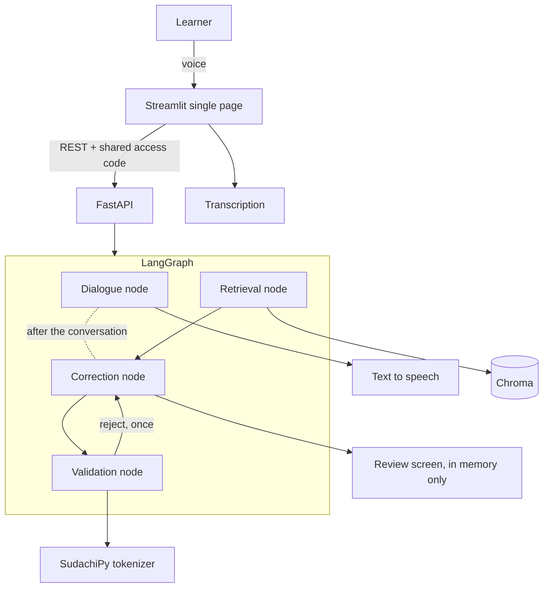

# Functional Design

**Translation of [`../ja/functional-design.md`](../ja/functional-design.md), which is authoritative.** If the two
disagree, the Japanese version is correct and this file needs updating.


> **Thin by design.** Structure and data shapes only, filled in here as implementation
> settles them.

## System diagram



**Nothing is persisted (decided 2026-08-16).** Corrections were originally written to
PostgreSQL; **nothing a learner says, records or gets corrected is stored anywhere** now
(see "The decision to store nothing" in [architecture.md](architecture.md)). Corrections live
in `st.session_state` for the length of the session and **disappear when the tab closes**.
Chroma is a read-only index and holds no learner data.

## Screen flow

One page only. It switches between three states; no second page is ever added.

```
Scene + level select ──▶ Conversation (record ▸ reply ▸ repeat) ──▶ Review
        ▲                              ▲                 │           │
        │                              └── "Say again" ───┘           │
        └──────────────── "Start another conversation" ───────────────┘
```

The state is decided by which keys exist in `st.session_state`: `scene` means conversation,
`review` means review, neither means selection. **Corrections are all run once the
conversation ends, and are never rendered outside the review.**

- The learner's own transcribed sentence is **always** shown, with a **Say again** button
  (never make them retype). ~~The count of presses is a proxy for transcription quality.~~
  → **Nothing is stored, so it cannot be counted** (2026-08-16). The button stays: its purpose
  is sparing the learner from retyping, not producing a metric.
  → **The button is not built (checked 2026-08-25).** There is only a prompt to say it again
  when nothing was heard; **once a sentence has been transcribed there is no way to take it
  back and say it differently.** Whether to build it or drop it is undecided.
- Only the **AI's** reply text can be hidden; hiding it turns the session into listening
  practice. ~~Which mode was used is recorded.~~ → **Not recorded** (same reason).
  → **Not built (checked 2026-08-25).** There is no toggle on the screen and no `show_ai_text`
  key. Whether to build it or drop it is undecided.
- Corrections never interrupt the conversation. The correction node runs **once the
  conversation is over, over all of the learner's sentences at once (ten at a time)**, and
  results appear only in the review. **Changed from per-turn on 2026-08-22**: the principle
  was always this, but the implementation ran on the turn, so the learner waited 4.78 seconds
  every turn for a result that was deliberately not shown to them.

## Core flow: why this is not a thin wrapper

The correction is emitted as **structured output** and then checked by deterministic Python
in the validation node:

1. **Rewrite-too-far check** — if the edit distance between the original and the corrected
   sentence exceeds the threshold, it is a different sentence, not a correction; discard it.
2. **Vocabulary level check** — tokenize the AI reply and regenerate if it contains too
   many words above the learner's level.
3. ~~**Over-correction suppression**~~ — **measured and not adopted (2026-08-20). See below.**

**Checks 1 and 2 ship; check 3 does not (settled 2026-08-20).**

- **Check 1 is in and currently fires on nothing.** Its threshold (normalised edit distance
  0.85) was set on the baseline's output, conservatively enough to discard no correct
  correction, and the largest rewrite this implementation produced was 0.818. **"Present and
  doing nothing" is stated rather than left to be discovered.**
- **Check 3 failed the bar registered before its predicates existed** (fire at least 20 points
  more often on already-natural sentences than on ones needing correction). The politeness
  predicate scored **-37.5pt — the wrong direction** — and would have taken detection accuracy
  to 50%; the admission predicate **fired on nothing at all**. **The bar was not lowered to fit
  them.**

The order they run in is in `graph/correction_graph.py`:

```
retrieve -> correct -> validate
```

**The screen and the API go through that same graph.** Two entry points over one graph, so the
screen cannot drift into behaving differently from what was measured.

This is what the baseline comparison is designed to prove: the naive single-call
implementation is measured on the same data, and the two are reported side by side.

## Data structures

### Evaluation item (`data/evaluation/*.json`) — the primary public artefact

```json
{
  "id": "eval-001",
  "scene": "greeting",
  "learner_sentence": "おはようです",
  "needs_correction": true,
  "corrected_sentence": "おはようございます",
  "reason_en": "The polite morning greeting is a fixed phrase.",
  "split": "dev"
}
```

`needs_correction: false` items carry no `corrected_sentence` or `reason_en`. The set is
91 items needing correction and 29 already-natural items, so over-correction is measurable.
(It was 90/30 until eval-052 was relabelled on 2026-08-13; the data is authoritative and
`tests/test_evaluation_items.py` pins it.)

### Correction result (structured output of the correction node) — fixed 2026-08-04

```json
{
  "needs_correction": true,
  "corrected_sentence": "おはようございます",
  "reason_en": "The polite morning greeting is a fixed phrase.",
  "grounding_ids": ["grammar-003"]
}
```

| Key | Type | Content |
|---|---|---|
| `needs_correction` | boolean | Required. Anything other than a boolean counts as a format failure |
| `corrected_sentence` | string \| null | Required when `needs_correction` is true. **Repairs the sentence they wrote**; it is not a better sentence of the model's own |
| `reason_en` | string \| null | Same. **One or two sentences of English.** Japanese quoted inside 「」 to point at a word is allowed |
| `grounding_ids` | array of string | **Filled from 2026-08-20.** The retrieved sections go **into the prompt**, and only the article ids the model says it **used** are kept. **Ids it invented are dropped**, so a hallucinated citation reaches neither the learner nor check 3. **Never attached afterwards** — that would show an article the model never read |

**Why grounding is not stapled on afterwards:** with a hit rate of 81.2% and no floor, roughly
**one citation in four would name an unrelated article**. A source the model did not read is not
a source; it is decoration.

**`discarded`** — a correction the validation node threw away is recorded **in full, not as a
flag**. When the real implementation scores below the baseline, the first thing to suspect is
that the check discarded corrections that were fine, and a boolean cannot answer that. `POST
/check` returns it too, so a discard is visible from outside rather than only in a run record.

When `needs_correction` is false, `corrected_sentence` and `reason_en` are **normalised to
null**. A sentence judged not to need changing has nothing to show, whatever the model chose
to put there.

Errors are **not categorised** by type (particle, conjugation, …). Beginners do not need it
and it makes both implementation and evaluation heavier.

**This JSON is parsed by us.** Provider-side constrained decoding (`with_structured_output`,
`responseSchema`) is deliberately not used: it would make the JSON half of
`format_compliance_rate` true by construction, **reporting as measured something that was
never measured.** It also keeps the baseline and the real implementation on one parsing path,
so there is only one scoring code path.

### Correction call result — what the evaluation script counts

One call to the correction engine returns the correction itself plus **what is needed to count
format compliance**. Without it the denominator of `format_compliance_rate` cannot be built.

| Field | Content |
|---|---|
| `learner_sentence` | The sentence that was judged |
| `correction` | The structured output above. **Empty when both attempts were malformed** — meaning unjudgeable, not "no correction needed" |
| `attempts` | 1, or 2 when it was retried |
| `format_problems` | Any of `invalid_json` / `reason_not_english`. Empty means compliant |

**`format_problems` describes the first attempt.** A retry that succeeded leaves it
non-compliant — if a retry could erase a format failure, **that is the same lie as dropping
the malformed cases from the denominator.** The correction itself may come from the retry
(accuracy and format are recorded separately, per glossary §5).

### Session and turn — **not persisted (revised 2026-08-16)**

~~A `session` table and a `turn` table in PostgreSQL.~~ → **No tables. No database.**

Session state lives in `st.session_state` and nowhere else.

| Key | Contents |
|---|---|
| `scene` / `level` | The chosen scene and level. **Their presence means "in conversation"** (this drives the screen flow) |
| `history` | The sequence of learner sentences (transcribed or typed) and AI replies |
| `spoken` | How far the replies have been read aloud, so **no reply is spoken twice**. The scene's opening line starts out marked as read: a page that talks to a room before anyone has said anything is not what this is |
| `corrections` | Correction results, produced in one batch when the conversation ends. **Never rendered outside the review** |
| `review` | **Its presence means "in review"** |
| `review_used_speech` | Whether the learner spoke. It decides **whether the review carries the note that transcription may have repaired a mistake**. Every conversation key is cleared when the session ends, so this is the one thing that crosses into the review |
| `unlocked` / `caveat_seen` / `used_speech` / `failure` / `unheard` / `audio_cache` | Screen bookkeeping: the shared code was accepted / the caveat has been shown / speech was used / the last failure / what to say when nothing was heard / **the session's synthesised audio** (so a repeated sentence is not synthesised twice; 20 entries, gone when the conversation ends) |

> **This table was reconciled with the implementation on 2026-08-25.** The previous version
> listed `turns` and `show_ai_text`; **neither exists in the code** (the real key is `history`).
> **`show_ai_text` was the pair of "only the AI's reply text can be hidden" below — a feature
> that was never built.**

**Closing the tab erases all of it.** No learner name, no utterance, no audio, no correction
result survives. **Latency, token counts and Say-again presses are not recorded either** (see
"What is deliberately not measured" in [product-requirements.md](product-requirements.md)).

**The per-day token and text-to-speech caps are the one exception.** They exist to bound cost,
so they are held **in-process as counters that identify nobody** — who used the app is not kept.

## Error handling

**Principle: a failure in correction never stops the conversation.** Corrections are shown
after the session, so a background failure is survivable. **A failure in the conversation is
never hidden**, however — when the AI goes silent, learners assume their pronunciation was
at fault.

| Failure | Behaviour |
|---|---|
| Transcription fails or returns empty | Show "I could not hear that" in English and prompt **Say again**. Not recorded as a turn |
| Correction JSON is malformed | **Retry once.** If still malformed, omit that sentence from the review — but **always count it in the denominator of `format_compliance_rate`** (hiding failures makes format compliance look better than it is) |
| How that retry is sent | **Send the first output back with what was wrong with it.** The correction runs at `temperature = 0`, so resending the same prompt returns the same malformed output and **the retry would be a retry in name only** |
| Reason comes back in Japanese | Use the output, but count it as non-compliant in `format_compliance_rate`. Accuracy metrics are unaffected. **Not retried** — the judgement is sound, only the language is wrong |
| Reason quotes Japanese inside it | Counts as compliant. "「は」 marks the topic" is how a particle gets explained, and a naive "contains Japanese, therefore non-compliant" rule **rejects the best reasons first**. Quoted spans are removed before the check |
| The correction call itself fails (API error) | **The conversation continues.** The sentence is recorded as unjudgeable and does not appear in the review as a correction |
| Unjudgeable sentences in the review | **Show the count** ("1 sentence could not be checked"). Dropping them silently reads as "these were fine", which is the one thing they are **not** known to be |
| Dialogue API error | Show an error and a retry button. **Never paper over it with a canned reply** — the learner must not think the AI simply ignored them |
| Still over level after regeneration | Use the reply as-is (one regeneration only) and record it as non-compliant in `level_compliance_rate` |
| Retrieval returns nothing | Treat as ungrounded: **state nothing as certain in the reason**, and if the original sentence is already natural, fall back to "no correction needed" |
| Recording exceeds the length cap | Show the cap before recording; anything beyond it is not sent |
| Daily token or TTS cap reached | **Block the start of a new conversation** and explain in English when it resets. Never cut off a conversation in progress |
| ~~Database write fails~~ | **Cannot happen (2026-08-16).** There is no database, so this row is gone |

**Counting format failures matters most.** Silently discarding malformed output inflates
`format_compliance_rate` and **makes the evaluation itself dishonest.**

## Evaluation is measured in two stages

The system is speech→text and then text→correction. Measuring only end to end cannot tell
which stage failed — transcription silently repairs learner mistakes, which makes a correct
correction engine look wrong.

| What | How | When |
|---|---|---|
| Correction engine | Evaluation script feeds the 120 items **as text, bypassing the app** | **Measured** |
| ~~Transcription~~ | ~~30 tester recordings transcribed by ear, compared to machine output~~ | **Not measured (2026-08-16)** |
| ~~End to end~~ | ~~Same sentences through both paths; the difference is what transcription erased~~ | **Not measured (2026-08-16)** |

**The speech stage goes unmeasured because audio is not stored**, so the material does not
exist. **The analysis above is still correct**, which is exactly why the README carries it as
a warning:

> **Correction figures are measured on text. The speech stage is not measured, so real accuracy
> when speaking is lower than these numbers.**

**Saying what was not measured is stronger than pretending it was.** This is the first thing
to restore when there is time again.
