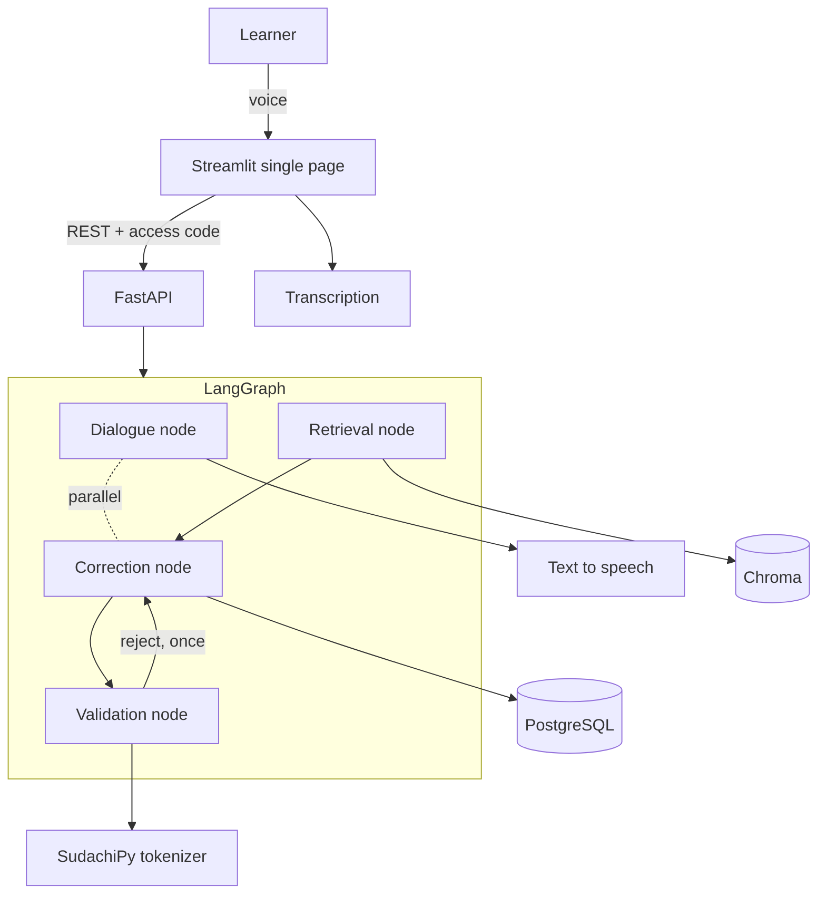

# Functional Design

**Translation of [`../ja/functional-design.md`](../ja/functional-design.md), which is authoritative.** If the two
disagree, the Japanese version is correct and this file needs updating.


> **Thin by design.** Structure and data shapes only, filled in here as implementation
> settles them.

## System diagram



## Screen flow

One page only. It switches between two states; no second page is ever added.

```
Scene + level select ──▶ Conversation (record ▸ reply ▸ repeat) ──▶ Review
                                        ▲                 │
                                        └── "Say again" ───┘
```

- The learner's own transcribed sentence is **always** shown, with a **Say again** button
  (never make them retype). The count of presses is a proxy for transcription quality.
- Only the **AI's** reply text can be hidden; hiding it turns the session into listening
  practice. Which mode was used is recorded.
- Corrections never interrupt the conversation. The correction node runs every turn in the
  background and results appear only in the review.

## Core flow: why this is not a thin wrapper

The correction is emitted as **structured output** and then checked by deterministic Python
in the validation node:

1. **Rewrite-too-far check** — if the edit distance between the original and the corrected
   sentence exceeds the threshold, it is a different sentence, not a correction; discard it.
2. **Vocabulary level check** — tokenize the AI reply and regenerate if it contains too
   many words above the learner's level.
3. **Over-correction suppression** — if no grounding was retrieved and the original sentence
   is already natural, fall back to "no correction needed".

This is what the baseline comparison is designed to prove: the naive single-call
implementation is measured on the same data, and the two are reported side by side.

## Data structures

### Evaluation item (`data/evaluation/*.json`) — the primary public artefact

```json
{
  "id": "eval-001",
  "scene": "greeting",
  "learner_sentence": "おはようです",
  "needs_correction": true,
  "corrected_sentence": "おはようございます",
  "reason_en": "The polite morning greeting is a fixed phrase.",
  "split": "dev"
}
```

`needs_correction: false` items carry no `corrected_sentence` or `reason_en`. The set is
90 items needing correction and 30 already-natural items, so over-correction is measurable.

### Correction result (structured output of the correction node)

```json
{
  "needs_correction": true,
  "corrected_sentence": "おはようございます",
  "reason_en": "The polite morning greeting is a fixed phrase.",
  "grounding_ids": ["grammar-003"]
}
```

Errors are **not categorised** by type (particle, conjugation, …). Beginners do not need it
and it makes both implementation and evaluation heavier.

### Session and turn (PostgreSQL)

- `session` — access code, scene, level, AI-text-shown flag, consent flag, timestamps
- `turn` — session id, transcript, say-again count, correction result, latency split into
  speech and non-speech, token counts

No learner name is stored. Audio is retained only for the September transcription study.

## Error handling

**Principle: a failure in correction never stops the conversation.** Corrections are shown
after the session, so a background failure is survivable. **A failure in the conversation is
never hidden**, however — when the AI goes silent, learners assume their pronunciation was
at fault.

| Failure | Behaviour |
|---|---|
| Transcription fails or returns empty | Show "I could not hear that" in English and prompt **Say again**. Not recorded as a turn |
| Correction JSON is malformed | **Retry once.** If still malformed, omit that sentence from the review — but **always count it in the denominator of `format_compliance_rate`** (hiding failures makes format compliance look better than it is) |
| Reason comes back in Japanese | Use the output, but count it as non-compliant in `format_compliance_rate`. Accuracy metrics are unaffected |
| Dialogue API error | Show an error and a retry button. **Never paper over it with a canned reply** — the learner must not think the AI simply ignored them |
| Still over level after regeneration | Use the reply as-is (one regeneration only) and record it as non-compliant in `level_compliance_rate` |
| Retrieval returns nothing | Treat as ungrounded: **state nothing as certain in the reason**, and if the original sentence is already natural, fall back to "no correction needed" |
| Recording exceeds the length cap | Show the cap before recording; anything beyond it is not sent |
| Daily token or TTS cap reached | **Block the start of a new conversation** and explain in English when it resets. Never cut off a conversation in progress |
| Database write fails | Continue the conversation. Record the gap in the application log — the tester's experience matters more than one usage row |

**Counting format failures matters most.** Silently discarding malformed output inflates
`format_compliance_rate` and **makes the evaluation itself dishonest.**

## Evaluation is measured in two stages

The system is speech→text and then text→correction. Measuring only end to end cannot tell
which stage failed — transcription silently repairs learner mistakes, which makes a correct
correction engine look wrong.

| What | How | When |
|---|---|---|
| Correction engine | Evaluation script feeds the 120 items **as text, bypassing the app** | August |
| Transcription | 30 tester recordings transcribed by ear by a native speaker, compared to machine output | September |
| End to end | Same sentences through both paths; the difference is what transcription erased | September |

The README must state plainly that correction numbers are measured on text.
