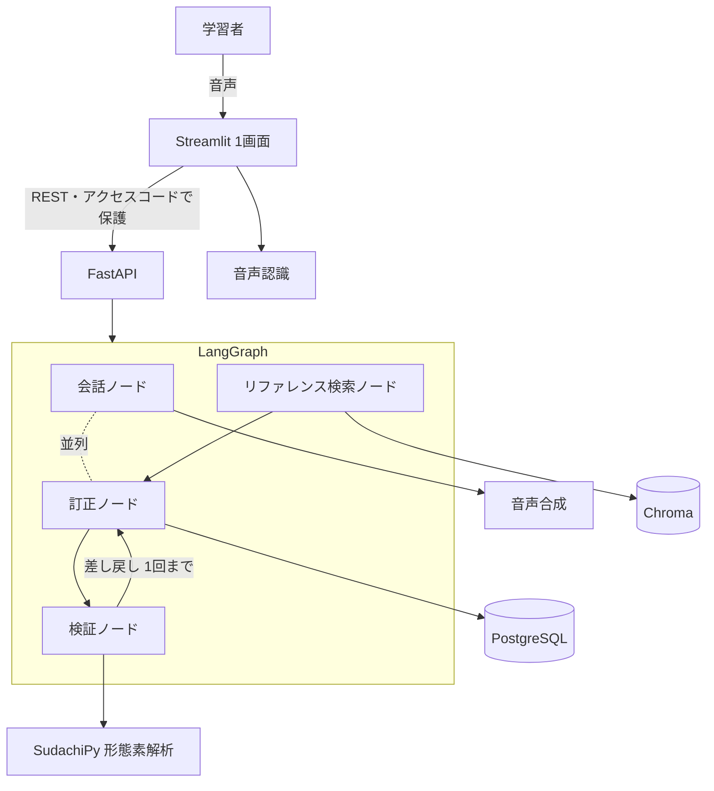

# 機能設計書

**この文書は日本語版が正。** 変更したら [`../en/functional-design.md`](../en/functional-design.md) も更新する。

> **薄く書く方針。** 構成とデータ構造のみ。実装で確定した内容を順次埋めていく。

## システム構成図



## 画面遷移

**画面は1つだけ。** 2つの状態を切り替えるだけで、別ページは決して作らない。

```
場面・レベル選択 ──▶ 会話中（録音 ▸ 返答 ▸ 繰り返し）──▶ 振り返り
                          ▲              │
                          └── もう一度 ───┘
```

- 学習者自身の書き起こし文は**常に表示**し、**「もう一度」ボタン**を置く（打ち直させない）。押された回数は音声認識の質を測る目安になる
- 隠せるのは **AI の返事の文字だけ**。消すと聞き取り練習になる。どちらで使ったかは記録する
- **訂正は会話に割り込ませない。** 訂正ノードは毎ターン裏で回し、結果は振り返りでのみ見せる

## 中核の流れ — 薄いラッパーでない根拠

訂正は**構造化された形式**で出させ、そのうえで検証ノードの**確定処理（Python）**で機械的に検査する。

1. **書き換えすぎの検出** — 元の文と直した文の編集距離が閾値を超えたら、それは訂正ではなく別の文なので捨てる
2. **語彙レベルの検査** — AI の返答を分かち書きし、学習者のレベルを超える語が多すぎたら生成し直す
3. **余計な直しの抑制** — 根拠が引けておらず、かつ元の文が十分自然なら「直す必要なし」に倒す

**これがベースライン比較で証明しようとしていることである。** 素朴な1回呼び出しの実装を同じデータで測り、2つを並べて出す。

## データ構造

### 評価データ1件（`data/evaluation/*.json`）— 主要な公開成果物

```json
{
  "id": "eval-001",
  "scene": "greeting",
  "learner_sentence": "おはようです",
  "needs_correction": true,
  "corrected_sentence": "おはようございます",
  "reason_en": "The polite morning greeting is a fixed phrase.",
  "split": "dev"
}
```

`needs_correction: false` の件は `corrected_sentence` と `reason_en` を持たない。全体は**直した方がいい90件＋そのままで自然な30件**で、これにより余計な直しが測定可能になる。

### 訂正結果（訂正ノードの構造化出力）

```json
{
  "needs_correction": true,
  "corrected_sentence": "おはようございます",
  "reason_en": "The polite morning greeting is a fixed phrase.",
  "grounding_ids": ["grammar-003"]
}
```

**誤りの種類分けはしない**（助詞／活用など）。初級者には不要で、実装も評価も重くなるだけである。

### セッションとターン（PostgreSQL）

- `session` — アクセスコード、場面、レベル、AI の文字表示フラグ、同意フラグ、日時
- `turn` — セッション ID、書き起こし文、もう一度の回数、訂正結果、**音声段と非音声段に分けた**応答時間、トークン数

学習者の氏名は保存しない。音声は9月の書き起こし比較に使う分だけ残す。

## エラーハンドリング

**原則：訂正側の失敗で会話を止めない。** 訂正は終了後にまとめて見せる設計なので、裏で失敗しても会話は続けられる。逆に**会話側の失敗は隠さない**——AI が黙ると学習者は自分の発音が悪いと思い込む。

| 失敗 | 挙動 |
|---|---|
| 音声認識が失敗、または空文字を返す | 「聞き取れませんでした」と英語で表示し、**もう一度**を促す。ターンとして記録しない |
| 訂正の JSON が壊れている | **1回だけ再試行**。それでも壊れていたらその文は振り返りに出さない。ただし `format_compliance_rate` の分母には必ず数える（**失敗を隠すと書式適合率が実態より良く出る**） |
| 理由が日本語で返る | 出力は使うが、`format_compliance_rate` では不適合として数える。精度の指標には影響させない |
| 会話生成の API がエラー | 画面にエラーと再試行ボタンを出す。**定型文でごまかさない**——学習者が「AI が反応しない」と誤解するのを避ける |
| レベル超過で再生成しても超過したまま | そのまま使う（再生成は1回まで）。`level_compliance_rate` の不適合として記録する |
| リファレンス検索が0件 | 根拠なしとして扱い、**理由で断定しない**。かつ元の文が十分自然なら「直す必要なし」に倒す |
| 録音が上限秒数を超えた | 録音前に上限を表示し、超えた分は送らない |
| 1日のトークンまたは音声合成の上限に到達 | **会話の開始をブロック**し、英語で理由と再開時刻を表示する。会話の途中で切らない |
| データベースへの書き込み失敗 | 会話は続行する。**利用ログの欠落としてアプリのログに残す**（テスターの体験を壊さない方を優先する） |

**書式の失敗は必ず数える**という点が重要である。壊れた出力を黙って捨てると、`format_compliance_rate` が実態より高く出て、**評価そのものが嘘になる。**

## 評価は2段階に分けて測る

システムは「声→文字」と「文字→訂正」の2段である。**通しの結果だけ見ると、どちらが悪いのか分からない。** 音声認識は学習者の言い間違いを勝手に直して書き起こすことがあり、そうなると正しい訂正エンジンが誤っているように見える。

| 測るもの | どう測るか | いつ |
|---|---|---|
| 訂正エンジン | 評価スクリプトが120件を**テキストのままアプリを通さず**流す | 8月 |
| 音声認識 | テスターの録音30件をネイティブが耳で書き起こし、機械の出力と比べる | 9月 |
| 通し | 同じ文を両方の経路で流し、差を出す＝音声認識がどれだけ誤りを消しているかが分かる | 9月 |

**README には「訂正の数字はテキストで測っている」と明記する。**
