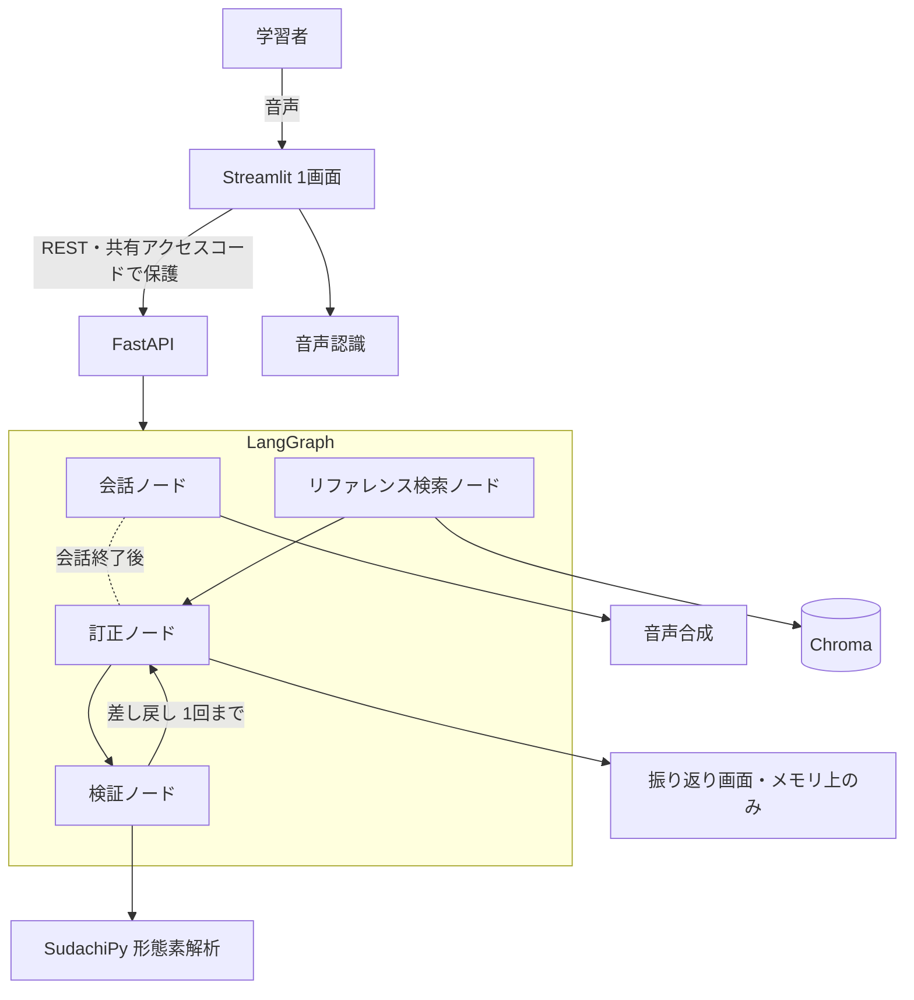

# 機能設計書

**この文書は日本語版が正。** 変更したら [`../en/functional-design.md`](../en/functional-design.md) も更新する。

> **薄く書く方針。** 構成とデータ構造のみ。実装で確定した内容を順次埋めていく。

## システム構成図



**永続化されるものは1つも無い（2026-08-16 決定）。** 当初は訂正結果を PostgreSQL に書く構成だったが、
**学習者の発話・音声・訂正結果をどこにも保存しない**ことにした（[architecture.md](architecture.md) の
「保存しないという決定」）。訂正結果はセッションの間だけメモリ（`st.session_state`）に載り、
**タブを閉じれば消える。** Chroma は読み取り専用の索引であり、学習者のデータは入らない。

## 画面遷移

**画面は1つだけ。** 3つの状態を切り替えるだけで、別ページは決して作らない。

```
場面・レベル選択 ──▶ 会話中（録音 ▸ 返答 ▸ 繰り返し）──▶ 振り返り
       ▲                  ▲              │                │
       │                  └── もう一度 ───┘                │
       └──────────── もう一度 会話する ────────────────────┘
```

状態は `st.session_state` のキーの有無で決まる（`scene` があれば会話中、`review` があれば振り返り、
どちらも無ければ選択）。**訂正は会話が終わった時点でまとめて実行し、振り返り以外では決して描画しない。**

- 学習者自身の書き起こし文は**常に表示**し、**「もう一度」ボタン**を置く（打ち直させない）。~~押された回数は音声認識の質を測る目安になる~~ → **保存しないので数えられない**（2026-08-16）。ボタン自体は残す——目的は指標ではなく、打ち直しを強いないことである
  → **ボタンは未実装（2026-08-25 に確認）。** 聞き取れなかったときに「もう一度言ってください」と促す文があるだけで、
  **一度書き起こされた文を取り消して言い直す道は無い。** 実装するか降ろすかは未決
- 隠せるのは **AI の返事の文字だけ**。消すと聞き取り練習になる。~~どちらで使ったかは記録する~~ → **記録しない**（同上）
  → **未実装（2026-08-25 に確認）。** 切り替えは画面に無く、`show_ai_text` というキーも存在しない。実装するか降ろすかは未決
- **訂正は会話に割り込ませない。** 訂正ノードは**会話を終えた時点で、発話をまとめて（最大10並列で）回す**。
  結果は振り返りでのみ見せる。**2026-08-22 に毎ターン実行から変更した**——原則は元からこれだが、
  実装は毎ターン裏で回しており、**学習者は見せない結果のために毎ターン 4.78 秒待っていた**

## 中核の流れ — 薄いラッパーでない根拠

訂正は**構造化された形式**で出させ、そのうえで検証ノードの**確定処理（Python）**で機械的に検査する。

1. **書き換えすぎの検出** — 元の文と直した文の編集距離が閾値を超えたら、それは訂正ではなく別の文なので捨てる
2. **語彙レベルの検査** — AI の返答を分かち書きし、学習者のレベルを超える語が多すぎたら生成し直す
3. ~~**余計な直しの抑制**~~ — **測定して不採用（2026-08-20）。下記**

**採用しているのは 1 と 2 である（2026-08-20 確定）。**

- **検証① は載っているが、いまは1件も発火していない。** 閾値（正規化編集距離 0.85）は
  ベースラインの出力で「正しい訂正を1件も捨てない」ことを優先して決めたもので、
  本実装の最大は 0.818 だった。**「載っているが何もしていない」と書く**
- **検証③ は事前登録した基準（`false` 側の発火率が `true` 側より20pt以上）で落ちた。**
  丁寧さの述語は **−37.5pt（向きが逆）**で `detection_accuracy` を 50% に落とし、
  admission 版は**1件も発火しなかった**。**基準を下げて通していない**

**実行される順序は `graph/correction_graph.py` にある**：

```
retrieve（検索）→ correct（生成）→ validate（確定処理）
```

**画面（Streamlit）も API（FastAPI）も、この同じグラフを通る。**
2つの呼び出し口が同じ1つのグラフを共有しており、**画面だけが測定と違う振る舞いをすることがない。**

**これがベースライン比較で証明しようとしていることである。** 素朴な1回呼び出しの実装を同じデータで測り、2つを並べて出す。

## データ構造

### 評価データ1件（`data/evaluation/*.json`）— 主要な公開成果物

```json
{
  "id": "eval-001",
  "scene": "greeting",
  "learner_sentence": "おはようです",
  "needs_correction": true,
  "corrected_sentence": "おはようございます",
  "reason_en": "The polite morning greeting is a fixed phrase.",
  "split": "dev"
}
```

`needs_correction: false` の件は `corrected_sentence` と `reason_en` を持たない。全体は**直した方がいい91件＋そのままで自然な29件**で、これにより余計な直しが測定可能になる（**当初は 90/30 だったが、2026-08-13 の eval-052 再ラベルで 91/29 になった**。実データが正本で、`tests/test_evaluation_items.py` が固定している）。

### 訂正結果（訂正ノードの構造化出力）— 2026-08-04 確定

```json
{
  "needs_correction": true,
  "corrected_sentence": "おはようございます",
  "reason_en": "The polite morning greeting is a fixed phrase.",
  "grounding_ids": ["grammar-003"]
}
```

| キー | 型 | 内容 |
|---|---|---|
| `needs_correction` | boolean | 必須。真偽値以外が来たら書式の失敗として扱う |
| `corrected_sentence` | string \| null | `needs_correction: true` のとき必須。**元の文を最小限だけ直す**（別の良い文を書かない） |
| `reason_en` | string \| null | 同上。**英語1〜2文。** 語を指すための「」内の日本語は許す |
| `grounding_ids` | string の配列 | **2026-08-20 に中身が入るようになった。** 検索した節を**プロンプトに入れて読ませ、モデルが「使った」と答えた記事 id だけ**を残す。**実在しない id は捨てる**（幻覚が学習者にも検証③にも届かないように）。**後から貼らない**——モデルが読んでいない記事を根拠として見せることになるため |

**`grounding_ids` を後貼りにしなかった理由**は、当たり率が 81.2%・`score_min` が 0 だった時点で
**4件に1件は無関係な記事が「根拠」として出る**ことが分かっていたからである。
**モデルが読んでいない出典は、出典ではなく飾りである。**

**`discarded`** — 検証ノードが捨てた訂正は、**フラグではなく中身ごと**実行記録に残す。
本実装がベースラインより悪い数字を出したとき、**最初に疑うのは「正しい訂正を検証が捨てた」こと**であり、
真偽値ではその問いに答えられない。`POST /check` の応答にも同じものを返す
（**捨てたことを外から見えなくしない**）。

`needs_correction: false` のとき、`corrected_sentence` と `reason_en` は **null に正規化する**。
モデルが「もっと丁寧な言い方もある」と書いてきても、直す必要がないと判定した文に見せるものはない。

**誤りの種類分けはしない**（助詞／活用など）。初級者には不要で、実装も評価も重くなるだけである。

**この JSON は自前で解析する。** プロバイダの制約デコード（`with_structured_output` /
`responseSchema`）は使わない。使うと `format_compliance_rate` の JSON 側が構造上つねに 100% になり、
**測っていないものを測ったことにしてしまう。** ベースラインと本実装が同じ解析経路を通るという
利点もある（採点コードが1本で済む）。

### 訂正の呼び出し結果 — 評価スクリプトが数えるもの

訂正エンジンの1回の呼び出しは、訂正そのものに加えて**書式の適合を数えるための情報**を返す。
これがないと `format_compliance_rate` の分母を正しく作れない。

| 項目 | 内容 |
|---|---|
| `learner_sentence` | 判定した学習者の文 |
| `correction` | 上の構造化出力。**2回とも壊れていたら空**（＝訂正なし、ではなく判定不能） |
| `attempts` | 1、または再試行した場合は 2 |
| `format_problems` | `invalid_json` / `reason_not_english` の並び。空なら適合 |

**`format_problems` は1回目の出力について記録する。** 再試行で直った場合も不適合のまま残す——
再試行が書式の失敗を消せるなら、**壊れた件を分母から捨てるのと同じ嘘になる。**
訂正の中身は再試行の結果を使ってよい（精度と書式は別々に記録するという glossary §5 の原則どおり）。

### セッションとターン — **永続化しない（2026-08-16 改訂）**

~~PostgreSQL に `session` テーブルと `turn` テーブルを持つ。~~ → **テーブルを作らない。データベースを使わない。**

セッション中の状態は `st.session_state` にだけ載る。

| キー | 内容 |
|---|---|
| `scene` / `level` | 選んだ場面とレベル。**あれば「会話中」を意味する**（画面遷移の判定） |
| `history` | 学習者の発話（書き起こし、または打ち込んだ文）と AI の返答の並び |
| `spoken` | どこまで読み上げ済みかの位置。**同じ返答を二度読ませない**ため。場面の最初の一言は読み上げ済みとして始める（誰も何も言っていないのに画面が喋り出さない） |
| `corrections` | 会話終了時にまとめて作った訂正結果。**振り返り以外では決して描画しない** |
| `review` | **あれば「振り返り」を意味する** |
| `review_used_speech` | 声で話したかどうか。**振り返りに「書き起こしが誤りを直したかもしれない」注意書きを出すか**を決める。会話中のキーは終了時にすべて消えるので、振り返りへ渡るのはこの1件だけである |
| `unlocked` / `caveat_seen` / `used_speech` / `failure` / `unheard` / `audio_cache` | 画面まわりの控え。共有コードを通ったか／注意書きを出したか／音声を使ったか／直前の失敗／聞き取れなかったときの文言／**セッション内の合成音声のメモ**（同じ文を二度合成しない。最大20件、会話終了で消える） |

> **この表は 2026-08-25 に実装と突き合わせて直した。** 旧版は `turns` と `show_ai_text` を挙げていたが、
> **どちらもコードに存在しない**（実物は `history`）。**`show_ai_text` は下の「隠せるのは AI の返事の文字だけ」
> と対になっていた未実装の機能である。**

**タブを閉じれば全部消える。** 学習者の氏名も、発話も、音声も、訂正結果も残らない。
**応答時間・トークン数・「もう一度」の押下回数も記録しない**（[product-requirements.md](product-requirements.md)
の「測らないと決めたもの」）。

**1日あたりのトークンと音声合成の上限だけは別**である。これは費用の歯止めなので、
**個人を識別しない集計カウンタとしてプロセス内に持つ**（誰が使ったかは残さない）。

## エラーハンドリング

**原則：訂正側の失敗で会話を止めない。** 訂正は会話が終わってからまとめて走るので、失敗しても会話そのものは終わっている。逆に**会話側の失敗は隠さない**——AI が黙ると学習者は自分の発音が悪いと思い込む。

| 失敗 | 挙動 |
|---|---|
| 音声認識が失敗、または空文字を返す | 「聞き取れませんでした」と英語で表示し、**もう一度**を促す。ターンとして記録しない |
| 訂正の JSON が壊れている | **1回だけ再試行**。それでも壊れていたらその文は振り返りに出さない。ただし `format_compliance_rate` の分母には必ず数える（**失敗を隠すと書式適合率が実態より良く出る**） |
| ↑ の再試行の投げ方 | **1回目の出力と「どこが壊れていたか」を添えて投げ直す。** 訂正は `temperature = 0` なので、同じプロンプトを投げ直すと同じ壊れた出力が返り、**再試行が形だけになる** |
| 理由が日本語で返る | 出力は使うが、`format_compliance_rate` では不適合として数える。精度の指標には影響させない。**再試行はしない**（判定は正しく、言語だけが違うため） |
| 理由の中で日本語を引用している | 適合として数える。「「は」 marks the topic」は正しい説明の書き方であり、**素朴に「日本語が含まれていたら不適合」にすると良い理由ほど落ちる**。「」と引用符の中を除いてから判定する |
| 訂正の呼び出し自体が失敗（API エラー） | **会話は続ける。** その文は判定不能として記録し、振り返りには訂正として出さない |
| 判定不能の文が振り返りにある | **件数だけ画面に出す**（「1 sentence could not be checked」）。黙って消すと「この文は問題なかった」と読めてしまい、それはその文について**唯一分かっていないこと**である |
| 会話生成の API がエラー | 画面にエラーと再試行ボタンを出す。**定型文でごまかさない**——学習者が「AI が反応しない」と誤解するのを避ける |
| レベル超過で再生成しても超過したまま | そのまま使う（再生成は1回まで）。`level_compliance_rate` の不適合として記録する |
| リファレンス検索が0件 | 根拠なしとして扱い、**理由で断定しない**。かつ元の文が十分自然なら「直す必要なし」に倒す |
| 録音が上限秒数を超えた | 録音前に上限を表示し、超えた分は送らない |
| 1日のトークンまたは音声合成の上限に到達 | **会話の開始をブロック**し、英語で理由と再開時刻を表示する。会話の途中で切らない |
| ~~データベースへの書き込み失敗~~ | **起きない（2026-08-16）。** データベースを使わないため、この行は消えた |

**書式の失敗は必ず数える**という点が重要である。壊れた出力を黙って捨てると、`format_compliance_rate` が実態より高く出て、**評価そのものが嘘になる。**

## 評価は2段階に分けて測る

システムは「声→文字」と「文字→訂正」の2段である。**通しの結果だけ見ると、どちらが悪いのか分からない。** 音声認識は学習者の言い間違いを勝手に直して書き起こすことがあり、そうなると正しい訂正エンジンが誤っているように見える。

| 測るもの | どう測るか | いつ |
|---|---|---|
| 訂正エンジン | 評価スクリプトが120件を**テキストのままアプリを通さず**流す | **測定済み** |
| ~~音声認識~~ | ~~テスターの録音30件をネイティブが耳で書き起こし、機械の出力と比べる~~ | **測らない（2026-08-16）** |
| ~~通し~~ | ~~同じ文を両方の経路で流し、差を出す~~ | **測らない（2026-08-16）** |

**音声段を測らないのは、音声を保存しないと決めたため**（材料が手に入らない）。
**この節の分析そのものは正しいまま**であり、だからこそ README には**警告として**書く。

> **訂正の数字はテキストで測っている。音声段は測っていないので、
> 実際に声で使ったときの精度はここの数字より低いはずである。**

**測っていないことを自分から書くほうが、測ったふりをするより強い。**
時間ができたときに最初に戻すのはここである。
